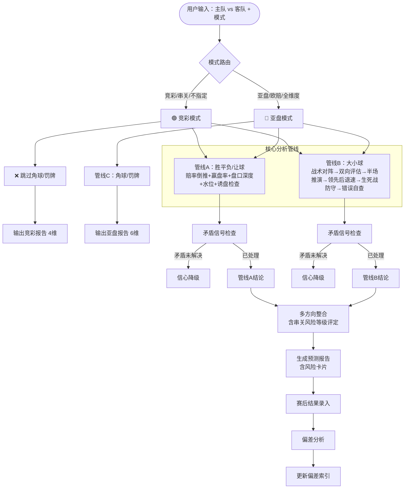

# ⚽ 足球预测分析技能 v8.4（七维自动赋值 + Logistic公式 + 弃权机制 + ⭐⭐80%）

> 本技能文件归集了以下目录下所有偏差分析、复盘、修正方案和流程图：
> - `预测数据/` — 17个文件
> - `memory/` — 5个文件
> - **共计22个源文件 → 统一为1个技能**

---

## 🚨 强制前置协议 — 每次预测必须执行

> **本协议是预测的强制入口。不执行完以下步骤，不得开始任何预测分析。**
>
> 📖 **快速命令参考**：遇到"阵型/轮换/伤病/战术风格/天气/裁判"等需求时，先查 `预测数据/预测前快速查询命令.md`

### 步骤 1：加载最新模型手册
确认当前会话已加载 SKILL.md 最新版本（v8.4）。

### 步骤 2：浏览偏差索引，标记当前比赛
打开[八、偏差索引](#八已知偏差索引25条活跃-3条已归档)，逐条检查当前比赛是否命中已知偏差模式。标记命中的偏差ID（如#007、#011）。

### 步骤 3：执行三级漏斗检查清单
跳转到[📋 三级漏斗检查清单](#-预测前三级漏斗检查清单50项-3-tier-funnel)，按顺序执行：
- 🔴 G01-G14 强制闸门（全部通过，否则终止）
- 🟡 Q01-Q18 质量评分（计算总扣分→质量守门分）
- 🟢 I01-I14 信息备注（赛后复盘补填，赛前跳过）

### 步骤 4：运行统一评分引擎
按[三、统一评分引擎](#三评分系统统一评分引擎-unified-grading-engine)的L1→L2→L3顺序计算 P_final，再按公式⑤计算+EV价值分。

### 步骤 5：先写文件再输出
将完整预测写入 `预测数据/足球预测-YYYY-MM-DD-主队vs客队.md`，然后输出到对话。


---

---

## 目录

- [一、核心工作流](#一核心工作流)
- [二、分析框架（10模块）](#二分析框架10模块)
- [三、评分系统（统一评分引擎）](#三评分系统统一评分引擎-unified-grading-engine)
- [四、权重系数表（全量）](#四权重系数表全量)
- [五、逻辑校验清单](#五逻辑校验清单)
- [六、场景分支规则](#六场景分支规则)
  - [6.9 联赛 vs 杯赛赢盘率分析方法论](#69-联赛-vs-杯赛赢盘率分析方法论)
  - [6.10 跨赛事互斥检查规则](#610-跨赛事互斥检查规则)
  - [6.11 淘汰赛大小球决策树（统一出口）](#611-淘汰赛大小球决策树统一出口取代62和649中矛盾规则)
- [七、已知偏差索引（25条活跃+6条已归档）](#七已知偏差索引25条活跃--6条已归档)
  - [偏差生命周期管理（防过拟合）](#偏差生命周期管理防过拟合)
  - [已归档偏差区](#-已归档偏差参考备注区不再强制赛前检查)
- [九、弃权机制 🚨（v8.4 新增）](#九弃权机制-v84-新增)
- [十、模型健康管理 🏥（v8.4 新增）](#十模型健康管理-v84-新增)
  - [10.1 版本对比机制](#101-版本对比机制)
  - [10.2 错误归因框架](#102-错误归因框架)
  - [10.3 赛事迁移测试](#103-赛事迁移测试)
  - [10.4 数据管线健康检查](#104-数据管线健康检查)
  - [10.5 多重共线性预警](#105-多重共线性预警)
  - [10.6 模型冻结期 🔒](#106-模型冻结期-)
- [📊 概率校准追踪（Probability Calibration）](#-概率校准追踪probability-calibration)
- [📋 输出模式规范](#-输出模式规范)
- [🔄 预测模型流程图](#-预测模型流程图)
- [📜 修正方案版本史](#-修正方案版本史)
- [📁 归集源文件索引](#-归集源文件索引)
- [📋 预测前三级漏斗检查清单（50项→3-Tier Funnel）](#-预测前三级漏斗检查清单50项-3-tier-funnel)

---

## 一、核心工作流

### 1️⃣ 数据收集
按比赛场景选择对应模式运行脚本：

| 模式 | 触发条件 | 命令 |
|:----|:---------|:-----|
| **竞彩模式** | 用户说"查竞彩/最新赔率" | `python skill/竞彩查询.py` + `python skill/fetch_match_data.py --mode jingcai` |
| **亚盘模式** | 用户说"看亚盘/查欧赔/Bet365" | `python skill/fetch_match_data.py --mode yapan` |
| **手动模式** | 无网络 | 基于已知基本面手动分析 |
| **基本面数据模式** | 需要历史赛果 | `python skill/openligadb_fetcher.py --report "主队"` |
| **xG数据模式（主推）** | 需要攻防真实实力 | `python skill/xg_estimator.py --home "主队" --away "客队"` |
| **Football-data.org模式** | 赛果/积分榜/赛程（世界杯/五大联赛/欧冠） | `python skill/fetch_match_data.py --mode football --home "主队" --away "客队"` |
| **TheSportsDB模式** | 瑞典超等小众联赛赛程/队名 | `python skill/fetch_match_data.py --mode sportsdb --home "主队" --away "客队"` |
| **ESPN模式** | NBA/WNBA/足总杯/亚洲杯/全球足球（免费，无需Key） | `python skill/fetch_match_data.py --mode espn --home "nba"` |
| **赛前情报模式** | 首发/L0-L4轮换/伤病/阵型/天气/裁判（辅助输入） | `python skill/team_news.py --home "主队" --away "客队"` |
| **一键预测** 🚀 | 自动运行所有管线，输出完整预测 | `python skill/predict.py --home "主队" --away "客队" --league wm26` |
| **Baseline对比+校准** 🆕 | 赛后校准：模型 vs FIFA排名基准 | `python skill/calibration_analysis.py` |

**🚀 一键预测（推荐——自动运行所有管线）**：
```bash
python skill/predict.py --home "主队" --away "客队" --league wm26
```
自动执行：基本面→xG攻防评分→赔率→赛前情报→P_final计算→评级→生成文件→记录盈亏追踪。

**传统分步模式**（如需手动控制每个步骤）：
各命令见下方。

**xG模式优势**：xG_for/90百分位数→L1进攻评分；xG_against/90百分位数→L1防守评分。无xG数据时L1评分自动降档-5%。

**结构性断点检测**（v8.0）：球队换帅/核心转会/系统性变阵时，断点前数据全部作废，仅用断点后场次计算xG_for/90。
```
断点信号（任一即触发）：①换帅 ②进球占比≥25%的球员转会 ④阵型系统性改变(连续3场新阵型)
触发后规则：断点后场次≥5场→仅用断点后数据；断点后场次<5场→标注"样本不足"，L1评分降权50%
```

**赢盘率查询**：`python skill/update_winrate.py --team "主队"`（联赛默认近6轮，杯赛默认近20场）。

**赛前情报查询**（首发/伤病/轮换/天气/裁判）：
```bash
# 交互式填写（分析师赛前查WhoScored/Flashscore后录入）
python skill/team_news.py --home "主队" --away "客队"

# 生成空模板（可提前编辑）
python skill/team_news.py --generate --home "主队" --away "客队"

# 从文件生成报告
python skill/team_news.py --file 数据缓存/team_news_xxx.json --report
```
输出：L0-L4分级 + 核心球员缺阵列表 + 阵型稳定性标记 + 裁判罚牌系数 → 注入L2 M系数和模块7λ参数。

### 2️⃣ 套用分析框架 → 生成预测草案
按[二、10模块](#二分析框架10模块)顺序执行：基本面→战术→交锋→盘口→变量→评分→比分→脚本→推荐→最终。

### 3️⃣ 执行三级漏斗检查清单
跳转到[📋 三级漏斗清单](#-预测前三级漏斗检查清单50项-3-tier-funnel)：
- 🔴 G01-G14强制闸门：全部通过，否则终止
- 🟡 Q01-Q18质量评分：计算扣分→质量守门分
- 🟢 I01-I14信息备注：赛后复盘补填

### 4️⃣ 运行统一评分引擎
按[三、统一评分引擎](#三评分系统统一评分引擎-unified-grading-engine)顺序计算：
- L1七维→P_base → L2场景修正(M系数+WVR) → L3偏差熔断→P_final
- 公式⑤：计算+EV价值分（P_calibrated vs 市场赔率）

### 5️⃣ 先写文件再输出
写入 `预测数据/足球预测-YYYY-MM-DD-主队vs客队.md` → 输出到对话 → MEMORY.md追加索引。

---

## 二、分析框架（10模块）

每个模块独立分析，提供分析素材和系数依据。最终⭐评级由统一评分引擎（L1→L2→L3+公式⑤）统一计算，各模块不再独立产出⭐。

### 模块1：基本面对比

| 维度 | 来源 | 权重系数 |
|:----|:----|:-------:|
| FIFA排名 | 官方排名 | **0.5**（排名≠实力，参考有限） |
| 小组赛战绩（胜/平/负） | OpenLigaDB `--report` 或 赛事数据 | 1.0 |
| 场均进球 | OpenLigaDB `--report` 自动统计 | 1.0 |
| 场均失球 | OpenLigaDB `--report` 自动统计 | 1.0 |
| **零封场次** 🛡️ | OpenLigaDB `--report` 自动统计 | **1.5** ⬆️（偏差#历史交锋教训） |
| 场均控球率 | 赛事数据 | 0.5 |
| 淘汰赛经验 | 历史参赛 | 0.5 |
| **东道主** 🏟️ | 赛事信息 | **2.0** ⬆️（偏差#003） |
| **交锋历史** 🔑 | OpenLigaDB `--h2h` 自动获取 | 小组赛×0.7 / 淘汰赛×0.5（#001） |

> 📡 **数据来源说明**：联赛/杯赛的历史基本面数据优先通过 `python skill/openligadb_fetcher.py` 获取
> （免费、无需 API Key），支持的联赛包括：德甲(bl1)、欧冠(ucl2024)、欧洲杯(em2024)、世界杯(wm26)等。

### 模块2：战术分析
- 阵型推演（首发预测）
- **阵型稳定性标记** 🔄：近3场阵型是否一致？若新阵型使用≤3场则战术适配度评分降权50%
- 进攻路线（边路/中路/定位球比例）
- 防守漏洞（0零封/核心伤缺）
- **轮换幅度分级（L0-L4）** 🔑（偏差#011）
- 核心博弈图（X vs Y）

#### 战术风格对阵矩阵

根据两队战术风格（高位逼抢/传控/防守反击/控制型防反/转换型）组合，预判比赛节奏和进球范围：

**风格分类细化**：
```
高位逼抢（高衝）     → 利物浦、阿根廷、巴西：前场高压，快速反抢
传控（Possession）    → 曼城、西班牙：控球主导，耐心组织
防守反击（防反）     → 马竞、意大利：低位防守，等待反击机会
控制型防反（控反）   → 皇马、法国：防守稳固但控球率不低，转换效率极高
转换型（Transition）  → 热刺、葡萄牙：攻守转换极快，不追求控球但追求射门质量
混合型               → 取决于对手和临场策略
```

| 风格A | 风格B | 节奏 | 大小球倾向 | 预期进球 | 说明 |
|:-----|:-----|:---:|:---------:|:--------:|:-----|
| 防守反击 | 防守反击 | 🐢慢 | 小球 | 0-1球 | 两队都立足防守，无空间 |
| 控制型防反 | 防守反击 | 🐢慢 | 小球 | 0-2球 | 控反队控球但难以打穿 |
| 传控 | 防守反击 | 🐢慢 | 小球 | 1-2球 | 传控遇密集防守 |
| 传控 | 控制型防反 | 中等 | 偏小 | 1-2球 | 双方都谨慎 |
| 控制型防反 | 控制型防反 | 中等 | 偏小 | 1-2球 | 互相限制 |
| 防守反击 | 高位逼抢 | ⚡快 | **大球** | **2-4球** | 反击队有冲刺空间 |
| 控制型防反 | 高位逼抢 | ⚡快 | **大球** | **2-4球** | 转换效率惩罚高位 |
| **转换型** | **高位逼抢** | **⚡最快** | **大球** | **3-5球** | 双方都打快，对攻破绽多 |
| 转换型 | 防守反击 | 中等 | 均衡 | 2-3球 | 节奏快但都重防守 |
| 传控 | 高位逼抢 | 中等 | 均衡 | 2-3球 | 对攻有空间 |
| 高位逼抢 | 高位逼抢 | ⚡快 | **大球** | **3-5球** | 对攻大战，失误多 |
| 传控 | 传控 | 中等 | 偏小 | 1-3球 | 控球争夺，射门少 |
| 转换型 | 传控 | 中等 | 均衡 | 2-3球 | 节奏可快可慢 |
| 转换型 | 转换型 | ⚡快 | **大球** | **2-4球** | 互捅局 |
| 混合型 | 任何 | 不确定 | 不确定 | 1-3球 | 取决于临场倾向 |

> ⚠️ 以上"预期进球"区间为经验值，基于风格判断而非数据回测。实际进球分布可能因球队执行力、临场变阵而显著偏离。
>
> ⚠️ **v8.4数据缺失警告**：当目标联赛**无大小球盘口数据**时，风格矩阵的"小球/大球"结论**自动降级为参考信息**，不得作为正式推荐依据。
> 2026-07-03天狼星vs米亚尔比(瑞典超) 实战验证："防反vs防反→小球"的机械推导在缺乏盘口验证时完全失效（预测小球2.25，实际8球）。
> 详见[6.5 联赛数据缺失协议](#-联赛数据缺失协议v84-新增)。

**应用方式**：确定两队主打风格→查矩阵→预判节奏和进球区间→作为大小球评估的参考输入。
风格判断优先级：近5场中出场≥3场的阵型所对应的风格为主风格。

#### 定位球攻防模型（v8.0 新增）

> 现代足球30~35%的进球来自定位球（角球+任意球+界外球）。风格矩阵覆盖了运动战进球预期，但定位球是独立变量。
> 当定位球强队遇上定位球防守弱队时，进球概率显著偏离风格矩阵预期。

**定位球效率分级**：
```
定位球进攻强队：定位球进球占比>35% OR 场均定位球射正>1.5次
定位球防守弱队：定位球失球占比>35% OR 场均定位球被射正>1.5次
```

**定位球修正矩阵**（⚠️ 修正值均为经验估计，未通过数据回测验证）：
```
| 定位球进攻方 | 定位球防守方 | 进球修正 | 角球预测修正 |
|:-----------|:-----------|:--------:|:------------:|
| 强          | 弱          | +0.5球   | 大角倾向     |
| 强          | 强          | +0.2球   | 正常         |
| 弱          | 弱          | -0.1球   | 正常         |
| 弱          | 强          | -0.3球   | 小角倾向     |
```

**应用方式**：
- 查风格矩阵获得底线预期进球（如防反vs防反→0-2球）
- 查定位球修正矩阵获得修正值（如定位球强队vs弱队→+0.5球）
- 合并预期进球区间 = 风格矩阵区间 ± 定位球修正
- 定位球修正独立于M系数，直接作用于模块7的λ参数

> **数据来源**：定位球进球占比来自FBref或Understat；手动统计时按"该队近10场定位球进球/总进球"估算。

### 模块3：历史交锋

> ⚠️ **淘汰赛权重系数 ×0.5**（偏差#001 — 来自墨西哥vs厄瓜多尔复盘）

| 赛事类型 | 权重系数 | 来源 |
|:--------|:-------:|:-----|
| 友谊赛/预选赛 | ×0.3 | 偏差教训#历史交锋权重 |
| 小组赛 | ×0.7 | — |
| 淘汰赛 | ×0.5 | 偏差#001 |

### 模块4：盘口与市场数据

> ⚠️ **盘口信号权重上限：1分（参考级别）**（偏差#009 — 来自偏差根因深度分析）

| 数据项 | 用途 | 权重 | 关键信号 |
|:------|:----|:---:|:--------|
| 欧赔（胜/平/负） | 机构信心 | 1分 | 平局赔率<3.20 = 参考信号 |
| 亚盘 | 穿盘能力 | 1分 | 盘口升级=参考信号 |
| 大小球 | 进球预期 | 1分 | 临场降盘=小球参考 |
| **OPTA概率vs赔率偏差** | **冷门预警** 🚨 | **1分** | 偏差>15%→冷门预警（偏差#008） |
| **专业资金流向** | **信号验证** | **1分** | 散户vs专业资金分歧=警惕（偏差#015） |

> **盘口信号不得单独作为⭐⭐⭐的依据，必须与基本面方向一致才有效。**

#### 盘口分析量化规则

**赢盘率差法**：
| 条件 | 判断 |
|:----|:-----|
| 两队赢盘率差<8% | 五五开格局，平局概率大，正常买+号方向 |
| 赢盘率差>10% | 有明显优势方，优势方赢盘率≥65%时方向有支撑 |

**盘口水位变动法**：
| 场景 | 信号 |
|:----|:-----|
| 深盘(≥1球)+上盘水位升>0.05 | 持续走高→不利于大胜 |
| 深盘+上盘水位降<0.05 | 降盘阻挡→利好穿盘 |
| 浅盘+上盘水位升>0.05 | 不利于大胜，防范客队反击 |

**竞彩单关分析法**：
| 场景 | 判断 |
|:----|:-----|
| 单关比赛 | ⚠️ 诱盘因素极大，需极度谨慎 |
| 单关+让胜水位<2.5 | 诱主概率大→防冷，考虑+号方向 |
| **非单关**+让胜水位≥2.85 | 让胜水位拉高→反而有利于穿盘打出 |
| 双平局格局(让平和平概率接近) | 让平水位1.6-1.8属正常平衡 |

### 模块5：关键变量

| 变量 | 权重调整 | 来源偏差 |
|:----|:--------:|:--------:|
| **核心球员缺阵损失** 🎯 | **见下方量化公式（取代旧±1-2球毛估）** | — |
| **"必须赢"战意** 🔴 | **M系数内调整：×1.3~1.5（C级WVR后×1.15~1.225，作用于P_final非直接调λ）** | **#007（4次复发）** |
| **领先后退速/保平收缩** | **领先/保平满足→进攻预期×0.5** | **#012** |
| **生死战防守提升** | **防守预期×1.3** | **#013** |
| **叙事驱动（复仇/纪录）** | **大球概率+0.5球** | **#014（阿尔及利亚3-3奥地利）** |
| **士气因素（逆转/连胜/悲剧动力）** | **进攻预期×1.3** | **历史交锋教训文件** |
| 轮换幅度（L0-L4） | 见4.5 | **#011（德国11人全替补）** |
| **赛程密度/休息天数** 🕐 | **M系数内调整：休息天数差≤-2→×0.95；连续双赛→×0.90（作用于P_final，非直接调λ）** | 多联赛验证（B级） |
| **大败后低迷** | **M系数内调整：输2球+→×0.5；输3球+→×0.3（见4.9，非直接调λ）** | **#017（AC奥卢）** |
| **主场连胜衰减** | **连胜越长→回归概率越大** | **#016（AC奥卢5连胜终结）** |
| 特殊场地（高原/高温） | 参考 | #003 |

#### 球员影响力评分与缺阵量化（v8.0 精细化版）

> **旧版局限**：旧公式只考虑"进球占比×位置系数"，但一个球员的贡献远不止进球。中后卫的防守贡献、组织核心的传球、边锋的突破都无法用进球衡量。
> **v8.0升级**：引入多维度球员影响力评分，按位置分别评估。

**球员影响力评分公式**（按位置分维度加权）：
```
球员影响力 = Σ(各维度值 × 维度权重)（⚠️ 以下维度权重均为经验值，未回测验证）

前锋评分维度：
  进球贡献(×0.4) + 射正率(×0.2) + 关键传球(×0.2) + 过人成功率(×0.2)

中场评分维度：
  传球成功率(×0.3) + 关键传球(×0.3) + 抢断(×0.2) + 跑动距离(×0.2)

后卫评分维度：
  抢断(×0.3) + 拦截(×0.3) + 解围(×0.2) + 争顶成功率(×0.2)

门将评分维度：
  扑救成功率(×0.5) + 出击成功率(×0.3) + 传球成功率(×0.2)
```

**缺阵损失到七维评分的映射**：
```
进攻缺阵损失 = 球员影响力评分 × 球队进攻评分(L1①) × 0.15
防守缺阵损失 = 球员影响力评分 × 球队防守评分(L1②) × 0.15

示例（前锋，影响力评分7.5，球队进攻评分7.5）：
  → 进攻损失 = 7.5 × 7.5 × 0.15 = 1.69分 → 进攻评分从7.5降至5.81
  → 同时触发#026低分预警（5.81≤6.5），自动导入L3矛盾信号

注意：若无法获取各维度数据，退化为旧版"进球占比×位置系数"公式。
     上述损失直接作用于L1七维评分中的进攻/防守维度评分值，
     而非作用于P_final。
```

### 模块6：评分系统
详见[三、评分系统（统一评分引擎）](#三评分系统统一评分引擎-unified-grading-engine)

### 模块7：命中区间预测（负二项分布引擎）

> **核心方法**：使用**负二项分布**(Negative Binomial)替代纯泊松分布，修正足球数据的**过分散**(overdispersion)问题。
> 泊松假设`方差=均值`，但实际足球数据`方差>均值`——纯泊松会低估0-0和4-3等极端比分概率。
> 预期进球 λ_A、λ_B 来自xG数据模式输出的 xG_for/90 和 xG_against/90。

#### 比分概率计算公式

```
P(比分=i-j) = NB(i; λ_A, θ) × NB(j; λ_B, θ)

其中NB为负二项分布概率质量函数：
  NB(k; λ, θ) = Γ(k+θ) / (k! × Γ(θ)) × (θ/(θ+λ))^θ × (λ/(θ+λ))^k

参数：
  λ_A = 主队 λ = 主队 xG_for/90 × 客队防守脆弱系数
  λ_B = 客队 λ = 客队 xG_for/90 × 主队防守脆弱系数
  θ   = 分散参数（dispersion parameter），控制方差大小
  i, j = 0, 1, 2, 3, 4+（4+合并为"4球及以上"）

防守脆弱系数 = 对手xG_against_avg / 联赛平均xG_against
门将修正 = 门将扑救成功率 / 联赛平均扑救成功率
  顶级门将（扑救率>78%）→ 门将修正×0.92（预期进球↓8%）
  普通门将（扑救率70~78%）→ 门将修正×1.00
  替补门将（扑救率<70%）→ 门将修正×1.08（预期进球↑8%）
注：赛程密度修正已由M系数统一处理，不再重复入λ → 防双重计算
注2：门将修正不适用于无法获取扑救率数据的比赛，默认=1.00
```

#### 分散参数θ的取值规则

```
θ = ∞（极大） → 退化为泊松分布（无过分散，θ越大越接近泊松）
θ = 10        → 轻度过分散（五大联赛典型值，方差≈均值×1.1）
θ = 5         → 中度过分散（杯赛/中游联赛典型值，方差≈均值×1.2）
θ = 2         → 高度过分散（低级别联赛/友谊赛，方差≈均值×1.5）

默认推荐值：
  五大联赛  → θ=10（进攻组织更稳定，过分散程度较低）
  杯赛      → θ=8（单场淘汰制偶然性更高）
  中游联赛  → θ=6（数据质量较低，波动更大）
  预设默认  → θ=8（无历史回测时的安全选择）
```

> 🔄 **θ值自动校准**（v8.0 已自动化）：以上θ推荐值（10/8/6）是经验初始值。现已实现自动拟合流程：
> ```
> 自动调度：每月初手动执行 `python skill/update_calibration.py --auto` 完成 θ 拟合
> 方法：用该联赛/杯赛所有历史比分，最大似然估计(MLE)拟合θ
> θ_new = argmax Σ ln(NB(k_i; λ_i, θ))    // 遍历θ∈[1,20]找最优化
> 更新规则：|θ_new - θ_current| > 1.5 → 自动更新并记入版本史
>            |θ_new - θ_current| ≤ 1.5 → 保留当前值（稳定优先）
> 回退保护：若本月样本N<50场 → 不更新，沿用上月值
> ```
> 在首次自动拟合完成前，默认使用θ=8（安全选择，覆盖绝大多数场景）。
>
> **与纯泊松的差异示例**（θ=8, λ=1.5时）：
> ```
> P(0-0): 泊松=5.5%, 负二项=6.8%  ↑ (低估)
> P(1-1): 泊松=12.4%, 负二项=12.1% ↓ (几乎不变)
> P(3-3): 泊松=0.8%, 负二项=1.4%  ↑ (低估)
> 大2.5概率: 泊松=47.5%, 负二项=47.8%  (大小球方向几乎不受影响)
> ```

#### 输出项

| 输出项 | 计算方法 | 用途 |
|:------|:---------|:-----|
| **Top 3比分** | 按P(i-j)降序取前3 | 比分推荐核心 |
| **保险区间** | 累加概率至≥85%的比分范围 | 风险控制 |
| **大2.5概率** | 1 - ΣP(i-j) 其中 i+j ≤ 2 | 大小球交叉验证（6.11第5步输入） |
| **大3.5概率** | 1 - ΣP(i-j) 其中 i+j ≤ 3 | 深盘大小球参考 |
| **BTTS概率** | ΣP(i≥1, j≥1) | BTTS方向参考 |
| **半场Top 3** | 用λ/2代入公式计算半场比分 | 半全场推荐 |
| **加时/点球概率** | 淘汰赛：P(90min平局) × P(加时不分胜负)（⚠️ 假设加时赛双方胜率相等，未经验证） | 淘汰赛特殊处理 |

#### 与xG管线的集成

```
xG_estimator.py 输出两队 λ_A, λ_B
       ↓
负二项引擎（公式见上文 θ 取值规则）计算全部分布
       ↓
大2.5概率 → 注入6.11决策树第5步(交叉验证)
BTTS概率 → 注入5.1矛盾检查
Top 3比分 → 输出到预测报告
```

#### 得势不得分检查

> 偏差#018 — 角球/控球统治≠进球保障

当泊松引擎给出低总进球预期(λ_A+λ_B < 2.0)但某队控球率预估>60%时，标注⚠️得势不得分风险：
```
射正率 = 该队近5场射正数/射门总数
若控球>60% 且 射正率<30% → 大球方向降级一档（⚠️ 30%/40%阈值为经验值，待数据验证）
若控球>60% 且 射正率>40% → 大球方向不变（高射正率可抵消控球虚高）
```

#### 角球/罚牌预测模型（v8.0 新增）

> **问题**：输出格式中角球和罚牌一直占位但无方法论。以下提供可直接执行的量化模型。

**角球预测公式**：
```
主队角球预测 = 主队近10场场均角球 × 战术风格修正 × 主客场修正
客队角球预测 = 客队近10场场均角球 × 战术风格修正 × 主客场修正

战术风格修正（⚠️ 粗略估计，需角球数据验证）：
  高位逼抢 → ×1.20（压迫导致角球增加）
  传控     → ×0.90（控球为主，远射多角球少）
  防反     → ×0.85（反击为主，阵地战少）
  混合型   → ×1.00

主客场修正（⚠️ 粗略估计）：
  主队 → ×1.10（主场进攻更积极）
  客队 → ×0.95（客场偏保守）
```

> 注：上述系数为**经验估计，未经回测验证**。英超实际数据显示高位逼抢球队角球比平均多8-15%（而非20%），传控球队角球与平均水平相当（而非低10%）。建议积累50场数据后校准。

**罚牌预测公式**：
```
主队罚牌预测 = 主队近10场场均罚牌 × 裁判严厉系数 × 比赛重要性修正
客队罚牌预测 = 客队近10场场均罚牌 × 裁判严厉系数 × 比赛重要性修正

裁判严厉系数（⚠️ 粗略估计，需回测）：
  裁判场均罚牌≥5张 → ×1.30（严哨——实际严哨约多10-15%非30%）
  裁判场均罚牌3~5张 → ×1.00（正常）
  裁判场均罚牌≤3张 → ×0.80（松哨——实际松哨约少10%非20%）
  裁判未知 → ×1.00（默认）

比赛重要性修正（⚠️ 粗略估计）：
  淘汰赛/德比 → ×1.15
  小组赛联赛  → ×1.00
  友谊赛      → ×0.80
```

> **注意**：角球/罚牌预测仅用于亚盘模式的角球/罚牌推荐，不参与胜负/大小球的评级计算。

### 模块8：预期比赛脚本
```
阶段1 (0-30min): 开局试探期（东道主→可能有激进修正）
阶段2 (30-60min): 核心博弈期（最可能进球段）
阶段3 (60-75min): 体能分水岭
阶段4 (75-90min): 终局（领先控场/平局加时/落后反扑）
```
> **东道主淘汰赛：阶段1开局激进系数1.3-1.5**（偏差#003 — ⚠️ 仅1场支撑，观察级）

### 模块9：推荐方向（含方向类型标识）
按优先级分为：**优先选择 > 高价值方向 > 不推荐**

每个推荐方向须标注**类型前缀**，使方向类型与信心评级解耦：
```
🏆 主胜 ⭐⭐⭐    → 胜平负方向，最高信心
⚽ 大球 ⭐⭐      → 大小球方向，中等信心
📊 穿盘 ⭐        → 盘口方向，基础信心
🎯 半场主队-0.5 ⭐⭐ → 半场方向
```
> **精算意义**：⭐⭐⭐表示P_final≥85%的置信水平，但不区分"这个高置信度是针对主胜还是大球"。
> 加上类型前缀后，用户一眼可知"哪个方向值得重注"——避免将"大球⭐⭐"和"主胜⭐⭐⭐"混为一谈。

### 模块10：最终推荐
输出最终排序，标明[方向类型]+⭐⭐⭐/⭐⭐/⭐

---

## 三、评分系统（统一评分引擎 Unified Grading Engine）

> 🚨 **架构变更 v7.3**：原"双轨并行"（10模块分析定性 + 七维模型定量）已整合为三级递进流水线，不再允许并行输出。

### 3.0 新架构总览

```
【输入数据】 
    ↓
【第一级：七维基础实力层】（定量基石）
    → 输出：基础胜率 P_base (0~100%) + 基础预期进球 xG_base
    ↓
【第二级：场景修正系数层】（模块2-5的权重落地）
    → 运用：东道主系数、必须赢因子、轮换幅度(L0-L4)、
            退速系数、生死战防守、连胜衰减、历史交锋权重
    → 计算：综合场景系数 M (0.5 ~ 1.8)
    ↓
【第三级：偏差截断与矛盾熔断】（风控闸门）
    → 检查：P0级偏差（#001/#002/#007/#008/#009/#011）是否触发？
    → 行动：触发则强制降级/移除；未触发则进入最终输出
    ↓
【最终输出】修正后胜率 P_final + ⭐评级 + 推荐方向
```

---

### 3.1 第一级：七维基础实力层（L1 — 定量基石）

沿用七维评分维度权重体系，计算基础胜率。

#### 维度权重体系

> ⚠️ **精算注释**：以下权重为**经验赋值，尚未经过回测验证**。这7个数字（20/20/15/15/15/10/5）来自分析师的领域判断，不是数据拟合结果。在积累200场以上预测记录后，应进行权重敏感性分析（sensitivity analysis）验证其合理性。

| # | 维度 | 权重 | 评分区间 | 说明 |
|:-|:----|:----:|:--------:|:-----|
| ① | **进攻能力** | **20%** | 1-10 | 场均进球、射门转化率、预期进球(xG)、核心射手状态 |
| ② | **防守稳固性** | **20%** | 1-10 | 场均失球、预期失球(xGA)、零封能力、防线完整度 |
| ③ | **中场控制力** | **15%** | 1-10 | 控球率、传球成功率、中场对抗成功率 |
| ④ | **大赛经验** | **15%** | 1-10 | 淘汰赛经验、核心球员大场面经历、教练水平 |
| ⑤ | **战术适配度** | **15%** | 1-10 | 风格克制关系、关键对位优劣势、是否被结构性克制 |
| ⑥ | **体能/状态** | **10%** | 1-10 | 近期走势(指数衰减加权)、伤病、停赛、体能储备、轮换程度 |
| ⑦ | **X因素** | **5%** | 1-10 | 主场加成、心理因素、情感/纪录驱动、偶然性、黑马潮 |

#### 评分原则

```
1. 每个维度独立评分（基于小组赛/近期实际数据，非印象流）
2. 评分必须有明确的评分依据（数据或事实），不得凭空赋值
3. 同一维度双方评分差≥3分时，标注"⚠️ 重大差距"
4. 战术适配度维度特别关注结构性克制关系（如速度克老化防线）
5. X因素不得高于8分（主观因素权重上限控制）
6. ⚠️ 防重复规则：已由L2模块2-5的M系数覆盖的维度（战术适配度、轮换状态），
   七维评分中应以"去重后基线"估分，不做精细量化（详见3.5）
7. 📉 **指数衰减加权**（仅用于⑥体能/状态维度）：近期比赛评分按距今天数指数加权，
   而非简单平均。3天前的比赛比60天前的比赛更具预测价值。
```

#### 🚨 v8.4 七维评分自动赋值规则（消除分析师主观差异）

> **问题**：旧版七维评分全凭分析师手动打1-10分，同一场比赛不同分析师可能差2-3分，
> 导致P_base不可复现。
> **修正**：以下4个维度改用**数据自动映射**，分析师只需填入基础数据即可自动算分。
> 剩余3个维度（④大赛经验、⑤战术适配度、⑦X因素）保留人工判断，但需附数据依据。

**① 进攻能力（自动映射）** — 基于 xG_for/90 或场均进球：

| xG_for/90 区间 | 评分 | 说明 |
|:--------------:|:----:|:-----|
| ≥ 2.0 | 9-10 | 顶级进攻火力 |
| 1.5 ~ 1.99 | 7-8 | 进攻强队 |
| 1.0 ~ 1.49 | 5-6 | 联赛平均 |
| 0.5 ~ 0.99 | 3-4 | 进攻偏弱 |
| < 0.5 | 1-2 | 进攻乏力 |

> 无xG数据时退化使用"场均进球"：
> 场均≥2.0→9-10, 1.5~1.99→7-8, 1.0~1.49→5-6, 0.5~0.99→3-4, <0.5→1-2

**② 防守稳固性（自动映射）** — 基于 xG_against/90 或场均失球：

| xG_against/90 区间 | 评分 | 说明 |
|:-----------------:|:----:|:-----|
| < 0.5 | 9-10 | 钢铁防线 |
| 0.5 ~ 0.99 | 7-8 | 防守稳固 |
| 1.0 ~ 1.49 | 5-6 | 联赛平均 |
| 1.5 ~ 1.99 | 3-4 | 防线漏洞 |
| ≥ 2.0 | 1-2 | 防线崩溃 |

> 无xG数据时退化使用"场均失球"：<0.5→9-10, 0.5~0.99→7-8, 1.0~1.49→5-6, 1.5~1.99→3-4, ≥2.0→1-2

**③ 中场控制力（自动映射）** — 基于控球率 + 传球成功率：

| 控球率 | 传球成功率 | 评分 | 典型球队 |
|:------:|:----------:|:----:|:---------|
| ≥ 60% | ≥ 85% | 8-10 | 西班牙、曼城 |
| ≥ 55% | ≥ 82% | 6-7 | 传控型中上 |
| 45~55% | 78~82% | 4-5 | 均衡型 |
| < 45% | < 78% | 2-3 | 防反型 |
| 数据缺失 | — | 5（默认） | 无法获取时取中间值 |

> 注意：中场控制力≠控球率。防反型球队控球率低但中场效率可能高（快速转换）。
> 遇到"防反队控球率<40%但转换效率极高"的场景，分析师可在自动分基础上±1分调整。

**⑥ 体能/状态（自动映射）** — 基于近5场指数衰减加权胜率：

| 近5场加权得分 | 评分 | 说明 |
|:-------------:|:----:|:-----|
| ≥ 2.3（≈4胜+） | 8-10 | 状态火爆 |
| 1.8 ~ 2.29（≈3胜+） | 6-7 | 状态良好 |
| 1.2 ~ 1.79（≈2胜+） | 4-5 | 状态一般 |
| 0.6 ~ 1.19（≈1胜+） | 2-3 | 状态低迷 |
| < 0.6（≈全败） | 1-2 | 状态崩溃 |

> 加权得分 = Σ(近5场得分 × 指数权重) / Σ(权重)
> 其中：每场得分=胜3/平1/负0，权重=e^(-天数/τ)，τ=21天(联赛)/14天(杯赛)
> ⚠️ 伤病/停赛等额外信息由分析师在自动分基础上手动调整（±1分），并在报告中注明

**⑦ X因素（人工判断，需附依据）**：
```
保留为唯一完全人工维度。每次赋值必须在报告中注明具体依据：
  - 主场加成：+1~2分（东道主淘汰赛+2分封顶）
  - 复仇/纪录驱动：+1分（需附具体事件）
  - 黑马潮：+1分（连续爆冷后的士气）
  - 限制：X因素总分不得超过8分
```

#### 七维评分使用规则（v8.4更新）

```
自动维度（①进攻/②防守/③中场/⑥状态）：
  ├─ 自动从xG/控球率/近期战绩映射得出
  ├─ 分析师如需调整，须在报告中注明"调整原因"
  └─ 默认使用自动赋值，除非有明确数据证明当前映射不适用

人工维度（④经验/⑤战术/⑦X因素）：
  ├─ ④大赛经验：淘汰赛经验丰富→7-9，首次参赛→3-5，无数据→5（默认）
  ├─ ⑤战术适配度：需分析师判断风格克制关系（核心判断点）
  └─ ⑦X因素：≤8分，必须附数据依据
```

#### 指数衰减加权公式（⑥体能/状态维度专用）

```
权重_t = e^(-天数 / 半衰期)
加权评分 = Σ(每场评分_t × 权重_t) / Σ(权重_t)

参数建议（⚠️ 经验值，待回测校准）：
  联赛半衰期 τ = 21天（约3周——待验证，可能应在7-30天之间）
  杯赛半衰期 τ = 14天（杯赛节奏更快——待验证）
  
示例：
  某队近5场比赛间隔45天，最老那场距今天数=45天
  → 权重_{45} = e^(-45/21) = 0.117（仅保留11.7%的权重）
  → 上一场(3天前) 权重_{3} = e^(-3/21) = 0.867（保留86.7%权重）
  → 简单平均让所有比赛各占20%，指数加权让近期的比赛占主导
```

#### 基础胜率公式

> ⚠️ **v8.4修正**：原公式`P_base=得分比`已被替换为Logistic函数。
> 旧公式假设得分与胜率呈线性关系，实际不成立（详见公式①精算注释）。

```
球队得分 = 进攻×0.20 + 防守×0.20 + 中场×0.15 + 经验×0.15 + 战术×0.15 + 状态×0.10 + X因素×0.05
得分差 = 球队A得分 - 球队B得分
P_base = 1 / (1 + e^(-α × 得分差))              // v8.4 Logistic映射
其中 α = 0.15（默认值，待200场后拟合校准）
```

---

### 3.2 第二级：场景修正系数层 + 权重验证基底（WVR）

> **精算铁律**：任何系数若未经≥30场回测验证，必须打折使用。本模型强制植入 **WVR（Weight Validation Rating）衰减机制**——对偏离1.0的部分按验证可信度打折，低可信度因子向中性(1.0)回归，而非穿越到反侧。

#### 权重验证等级定义（精算可信度标准）

| 等级 | 样本量要求 | 系数可信度 | 对偏离1.0的生效比例 | 标记 |
|:---:|:-----------|:---------:|:------------------:|:----:|
| **A级（已验证）** | ≥ 30场同场景回测 | **100%（全额）** | 保留100%偏差 | ✅ |
| **B级（观察级）** | 10 ~ 29场 | **75%** | 保留75%偏差 | ⚠️ |
| **C级（经验/推论级）** | < 10场（含单场极端个案） | **50%** | 保留50%偏差 | 🔴 |

#### 核心权重的验证等级锚定表

> 以下是将手册中全部高频使用因子，按精算实务标准硬锚定到验证等级。**精算注释**："必须赢因子"号称"4次复发"——精算上4个样本点连"小样本"都算不上，只能算"个案观察"。

| 场景变量 | 原始系数 | WVR等级 / 支撑样本量 | 偏差值 | **有效系数（偏离度衰减后）** |
|:---------|:--------:|:-------------------:|:------:|:--------------------------:|
| **小组赛实力均衡局（小2.25）** | ×1.00 | **A级**（多届赛事≥30场） | ±0.0 | **×1.00** ✅ |
| 淘汰赛历史交锋折扣 | ×0.50 | **B级**（~15场淘汰赛） | -0.50 | 1.0 + (-0.50)×0.75 = **×0.625** |
| 东道主（淘汰赛） | ×1.15 | **B级**（~15场） | +0.15 | 1.0 + 0.15×0.75 = **×1.112** |
| **"必须赢"战意因子** | **×1.30~1.45** | **🔴 C级**（仅4场复发案例） | +0.30~0.45 | **1.0 + (偏差)×0.50 = ×1.15~1.225** |
| 轮换 L4（全替补） | ×0.55 | **🔴 C级**（1场极端案例） | -0.45 | 1.0 + (-0.45)×0.50 = **×0.775** |
| 轮换 L3（大幅轮换） | ×0.70 | **C级**（有限样本） | -0.30 | 1.0 + (-0.30)×0.50 = **×0.85** |
| 轮换 L2（中等轮换） | ×0.85 | **B级**（多场联赛样本） | -0.15 | 1.0 + (-0.15)×0.75 = **×0.887** |
| 主场连胜 ≥5场 | ×0.85 | **🔴 C级**（1场芬超） | -0.15 | 1.0 + (-0.15)×0.50 = **×0.925** |
| 主场连胜 3-4场 | ×0.92 | **C级**（少量样本） | -0.08 | 1.0 + (-0.08)×0.50 = **×0.96** |
| 已淘汰放开踢（零封降级） | ×0.90 | **C级**（~4场） | -0.10 | 1.0 + (-0.10)×0.50 = **×0.95** |
| 生死战防守提升 | ×1.10 | **C级**（~5场） | +0.10 | 1.0 + 0.10×0.50 = **×1.05** |
| 东道主（小组赛） | ×1.08 | **B级**（多届小组赛） | +0.08 | 1.0 + 0.08×0.75 = **×1.06** |
| **赛事类型（淘汰赛）** | **×0.95** | **B级**（跨赛事累计验证） | -0.05 | 1.0 + (-0.05)×0.75 = **×0.962** ⚠️ |
| 赛程密度（休息天数差） | 见下方规则 | **B级**（多联赛验证） | 见下方 | 连乘入M |
| **赛季阶段因子** | 见下方规则 | **C级**（经验值，待数据校准） | 见下方 | 连乘入M |

#### 赛程密度因子取值规则

> **来源**：赛程密度是足球预测中被广泛验证的变量。休息不足的球队跑动距离↓、下半场失球↑。

```
休息天数差 = 主队休息天数 - 客队休息天数

取值规则（⚠️ 系数和阈值均为经验值，待数据校准）：
  休息天数差 ≥ +2（主队多休息2天+） → ×1.00（不调整）
  休息天数差 = -1 ~ +1（休息相当）  → ×1.00（不调整）
  休息天数差 = -2 ~ -3（主队少休2-3天） → ×0.95
  休息天数差 ≤ -4（主队少休4天+）   → ×0.90
  连续3场每周双赛(杯赛+联赛)        → ×0.90（即使单场休息天数够）

WVR等级：B级（多联赛样本支撑，但具体系数需积累更多数据校准）
```

#### 赛季阶段因子取值规则（⚠️ 经验值，待数据校准）

> **来源**：赛季不同阶段球队战意差异显著。保级队赛季末爆发，无欲无求队赛季末放松。
> 此因子与#007"必须赢"战意因子协同但不重复——#007覆盖"单场必须赢"，此因子覆盖"剩余赛季整体战意"。

```
取值规则：
  赛季中（非最后5轮）                    → ×1.00（不调整）
  赛季末最后5轮 + 保级/争冠区球队        → ×1.08（战意加成）
  赛季末最后5轮 + 无欲无求(中游无压力)   → ×0.92（可能放松）
  赛季末最后5轮 + 已确定排名(无欲无求)   → ×0.85（提前放假）
  杯赛决赛/半决赛                       → ×1.05（战意加成，非赛季末）

WVR等级：C级（经验值，需积累100场以上数据校准）
```

#### 新M系数计算公式（含WVR衰减）

```
有效因子 = 1.0 + (原始系数 - 1.0) × WVR生效比例

综合场景系数 M = 1.0 
  × (赛事类型因子 × 该因子WVR衰减)                 // 小组赛1.0 / 淘汰赛0.962(B级WVR)
  × (东道主因子 × 该因子WVR衰减)                   // 互斥三选一：非东道主=1.0 / 东道主小组赛=1.06 / 东道主淘汰赛=1.112
  × ("必须赢"战意因子 × 该因子WVR衰减)             // 触发→1.15~1.225（C级砍半！）
  × (轮换损害因子 × 该因子WVR衰减)                 // L0=1.0 / L1=0.962 / L2=0.887 / L3=0.85 / L4=0.775
  × (赛程密度因子 × 该因子WVR衰减)                 // 新增——休息天数差调整
  × (赛季阶段因子 × 该因子WVR衰减)                 // 赛季中=1.0 / 赛季末(最后5轮)保级队=1.08 / 赛季末无欲无求=0.92
  × (防守稳固修正 × 该因子WVR衰减)                 // 互斥三选一：不触发=1.0 / 生死战=1.05 / 已淘汰=0.95（⚠️ 原始系数×1.10/×0.90来自~5场，C级）
  × (主场连胜衰减 × 该因子WVR衰减)                 // <3场1.0 / 3-4场0.96 / ≥5场0.925（⚠️ 原始系数仅1场AC奥卢，C级）
  × (历史交锋权重因子 × 该因子WVR衰减)             // 小组赛1.0 / 淘汰赛0.625(B级)
```

#### WVR关键限制规则

| 规则 | 内容 |
|:----|:------|
| **盘口隔离** | 模块4盘口信号/市场赔率不进入M系数，仅作为L3独立校验信号（不受WVR约束） |
| **最高位约束** | 单场不得同时取3个及以上\|偏差\|>0.10的因子（⚠️ 阈值"3个"为经验值，未回测验证） |
| **C级数量上限** | 单场比赛最多使用3个C级因子，超过则自动降低一个评级档（⚠️ 上限"3个"为经验值） |
| **零封修正除外** | 已淘汰球队零封系数(×0.5)已在4.3单独处理，不入M系数 |

---

### 3.3 第三级：偏差截断与矛盾熔断（L3 — 风控闸门）

#### P0级偏差强制检查清单

```
□ #001 历史交锋权重过高  → 已在M系数中WVR修正（淘汰赛×0.625）
□ #002 BTTS+小2.25矛盾  → 交5.1逻辑校验，互斥则禁止推荐
□ #007 "必须赢"进攻爆发 → 已在M系数中WVR修正（C级→有效×1.15~1.225）
□ #008 冷门预警         → 🚨 触发则**强制移除主方向**，优先于一切
□ #009 盘口信号权重过高  → 盘口不得入M，仅作L3校验信号
□ #011 轮换幅度L4       → 已在M系数中WVR修正（C级→有效×0.775）
□ #026 极端低分         → 七维评分中任一维度≤6.5 → 自动导入矛盾信号列表
```

#### 矛盾信号处理流程

```
① 七维评分维度中是否有≤6.5维度（#026）？→ 记录为🟡轻微矛盾
② #008是否触发（赔率vs概率偏差>15%）？  → 触发则强制移除（最高优先级）
③ 盘口信号与基本面方向是否一致？       → 不一致则降级一档
④ P0级偏差是否全部已处理？             → 未处理则不得进入最终输出
⑤ 评级调档（如需）：⭐⭐⭐→⭐⭐ 或 ⭐⭐→⭐ 或 ⭐→❌
```

---

### 3.4 核心计算公式（精算级量化）

#### 公式①：基础胜率（L1输出）

> ⚠️ **v8.4修正**：原`P_base=得分比`公式因"虚假精度"问题被替换。
> 旧公式（得分比=7.2/13.3=54.1%）的绝对值依赖评分尺度选择，没有统计意义。
> 新公式使用Logistic映射，得分差→概率，消除评分尺度依赖。

```
得分差 = 球队A得分 - 球队B得分
P_base = 1 / (1 + e^(-α × 得分差))

其中：
  α = 0.15    // 默认斜率参数（待累计200场后拟合校准）
  β = 0.0     // 无偏置（假设得分差0→胜率50%合理）
```

> 📐 **精算解释**：Logistic函数将"得分差"映射到(0,1)概率空间，解决了旧公式的三个问题：
> 1. **尺度无关**：得分差=1.0 → P_base≈53.7%，无论评分是1-10还是1-100
> 2. **S形曲线**：得分差在0附近时≈线性，两端渐近——真实足球数据的分布特征
> 3. **可校准**：α控制S形斜率，可从历史数据拟合得出
>
> **旧公式（已废弃）**：`P_base = 球队A得分 / (球队A得分 + 球队B得分)`
> 原因：得分比的绝对值依赖评分尺度选择，在1-10分制下产生53-55%的"虚假精度"

#### 公式②：综合场景系数 M（L2输出，含WVR衰减）

```
有效因子 = 1.0 + (原始系数 - 1.0) × WVR生效比例    // 偏离度衰减
M = ∏(各有效因子)                                    // 连乘，见3.2完整公式及WVR锚定表
```

#### 公式③：修正后胜率 P_final（赔率比空间映射法）

```
OddsRatio_base = P_base / (1 - P_base)                 // 基础赔率比
OddsRatio_adj  = OddsRatio_base × M                    // 场景修正后赔率比
P_final        = OddsRatio_adj / (1 + OddsRatio_adj)   // 转回概率

// 等效展开式（同一公式，可直接使用）：
// P_final = (P_base × M) / (P_base × M + (1 - P_base))
```

> ⚠️ **注意**：必须使用赔率比(Odds Ratio)形式而非十进制赔率(Decimal Odds)形式。十进制赔率法（P_final = 1/(1/P_base/M)）简化为 P_final=P_base×M，可突破100%，已被废弃。
>
> 📐 **天花板/地板效应**：当 P_base>85% 或 P_base<15%时，M系数对P_final的边际影响急剧衰减。示例：
> ```
> P_base=90%, M=1.2 → P_final=91.5%（M的+20%偏离仅产生+1.5pp变化）
> P_base=10%, M=1.5 → P_final=14.3%（M的+50%偏离仅产生+4.3pp变化）
> ```
> 这是Odds Ratio映射的数学特性（sigmoid曲线的两端平坦区），**不是bug**。但分析师应知悉：
> - 极高/极低P_base的比赛，L2场景修正的作用有限，评级主要依赖L3偏差熔断
> - 不要因为"已启用M系数修正=1.2"就认为充分考虑了场景因素
> - 修正这类比赛的重心应放在L1七维评分的质量上，而非L2的M系数

#### 公式④：⭐评级映射（P_final × 质量守门分 双重约束）

> 评级由两个维度共同决定：**P_final精算胜率**（第1-3层流水线产出）和 **质量守门分**（第3-2层三级漏斗检查产出）。两者权重70/30加权，取代旧版纯P_final硬映射。（⚠️ 70/30权重为经验值，未回测验证）

**质量守门分**来自预测前三级漏斗检查的第2层（参见📋 预测前三级漏斗检查清单）：
```
质量守门分 = 100 - 第2层总扣分    // 满分100，逐项扣减
```

**最终评级分计算公式**：
```
最终评级分 = P_final × 0.7 + 质量守门分 × 0.3
```

**评级映射表**（取代旧版P_final-only硬映射）：
```
最终评级分    条件                          ⭐评级
─────────────────────────────────────────────────────
≥ 85          无触发#008                    ⭐⭐⭐（高度推荐）
70 ~ 84       无触发#008                    ⭐⭐（推荐方向）
55 ~ 69       无触发#008                    ⭐（值得关注）
< 55          任意                          ❌（不推荐，或标注博冷）
任意          触发#008冷门预警               ⛔ 强制移除（不得入串）
─────────────────────────────────────────────────────
```

**精算解释**：权重70/30意味着——
- P_final=72%（旧版⭐⭐⭐门槛）配合质量守门分=100 → 72×0.7+100×0.3=**80.4** → ⭐⭐（质量完美但精算胜率不够高，不给⭐⭐⭐）
- P_final=80%配合质量守门分=90 → 80×0.7+90×0.3=**83** → ⭐⭐（质量有瑕疵）
- P_final=80%配合质量守门分=100 → 80×0.7+100×0.3=**86** → ⭐⭐⭐（胜率高+质量完美）
- P_final=55%配合质量守门分=100 → 55×0.7+100×0.3=**68.5** → ⭐（质量再好也救不了低胜率）

> **裁决优先级**：#008强制移除 > 最终评级分映射 > 矛盾信号调档

---

<!-- SYSTEM2: 以下 +EV价值判定 属于系统2投注引擎，系统1预测引擎不引用 -->
#### 公式⑤：+EV价值判定（投注决策核心）

> **精算铁律**：高胜率 ≠ 好投注。只有当 `P_calibrated × 市场赔率 > 1.0` 时才有正期望值(+EV)。
> 本公式将概率和市场价格打通，用**价值标尺**取代纯概率评级。

**价值分计算公式**：
```
市场隐含概率(MIP) = 推水后的赔率隐含概率     // 扣除庄家抽水(vig)
价值分 = P_calibrated / MIP - 1.0            // 正值即存在+EV

其中：
  MIP = (1/odds) / Σ(1/odds_all_outcomes)   // 推水修正，见5.8冷热偏差
  P_calibrated = P_final × 校准因子           // 来自概率校准章节
```

**价值标尺与评级融合表**（最终推荐以此为唯一输出）：
```
P_calibrated区间   价值分        质量守门分    融合判定                    动作
────────────────────────────────────────────────────────────────────────
≥ 72%              ≥ +5%        ≥ 80          🏆 强推(+EV)              加注
≥ 72%              ≥ +5%        < 80          ✅ 推荐(+EV)              常规（质量瑕疵不达🏆）
≥ 72%              < +5%        任意          📊 方向正确但无价值         常规
60~71%             ≥ +5%        ≥ 70          ✅ 推荐(+EV)               小额
60~71%             ≥ +5%        < 70          ⚠️ 有+EV但质量差           跳过或极小额
60~71%             < +5%        任意          ⚠️ 市场已定价              谨慎或跳过
50~59%             ≥ +10%       ≥ 70          📌 博冷(+EV博冷)           允许小注
50~59%             ≥ +10%       < 70          ❌ 博冷但质量差            跳过
50~59%             < +10%       任意          ❌ 不推荐                  跳过
< 50%              任意         任意          ❌ 不推荐                  跳过
任意               触发#008     任意          ⛔ 强制移除                禁止
```

**精算解释**：
- P_calibrated=80% + +EV+10% + 质量守门分=85 → 🏆 强推（三重验证通过）
- P_calibrated=80% + +EV+10% + 质量守门分=60 → ✅ 推荐（概率高+有+EV，但分析粗糙→降档）
- P_calibrated=65% + MIP=58.8% → 价值分=+10.5% + 质量守门分=75 → ✅ 推荐(+EV)
- P_calibrated=80% + MIP=80.0% → 价值分=0% → 📊 无价值（即使⭐⭐⭐也不该投注）
- P_calibrated=40% + MIP=28.6% → 价值分=+39.9% + 质量守门分=80 → 📌 博冷选项

<!-- SYSTEM2: +EV价值判定 结束 -->
> ⚠️ **纪律要求**：即使P_calibrated很高，如果价值分<+5%，不得打出"强烈推荐"标签。
> +EV是**唯一长期盈利的来源**，预测精度只是辅助。没有+EV支撑的⭐⭐⭐=误导。
> 质量守门分<70时，任何方向不得进入"🏆强推"或"✅推荐"级别——分析质量是+EV的前提。`

### 3.5 模块2-5（10模块分析）的新角色定位

修复后，模块2-5不再独立产出⭐⭐⭐，转而承担两项明确任务：

| 模块 | L2贡献（M因子取值依据） | L3贡献（矛盾信号） |
|:----|:-----------------------|:------------------|
| **模块2** 战术分析 | 轮换损害因子（L0-L4分级→系数） | 战术适配度低分→#026信号 |
| **模块3** 历史交锋 | 历史交锋权重因子（赛事类型→系数） | 历史矛盾模式 |
| **模块4** 盘口与市场 | **不进入M**（仅L3校验） | #008冷门预警、盘口方向校验 |
| **模块5** 关键变量 | 东道主因子/必须赢因子/赛程密度因子/防守修正/连胜衰减/退速系数 | 变量冲突信号 |

#### 防重复规则（去重机制）

```
当某一维度同时在七维评分(L1)和M系数(L2)中被覆盖时：

  例：战术适配度 → L1七维评分中有15%权重，L2的轮换损害因子也涉及战术影响
  
  处理规则：
  ├─ L1七维评分应使用"去重后基线"估分（如战术适配度仅评5-7分区间粗分）
  ├─ L2的M系数负责该维度的精细化场景调整
  └─ 总影响 = L1去重基线 + L2场景修正，不得将同一调整做两次
```

---

### 3.6 输出格式示例

每个预测文件中的评分改为统一评分引擎格式（含WVR快照）：

```markdown
━━━━━━━━━━━━━━━━━━━━━━━━━━━━━━━━━
📊 统一评分引擎输出
━━━━━━━━━━━━━━━━━━━━━━━━━━━━━━━━━
【七维基础】主队得分 7.2 | 客队得分 6.1 → P_base = 54.1%
【场景修正】淘汰赛(0.95) × 东道主(1.112) × 必须赢(1.175) × 赛程密度(1.0) × L0(1.0) × 历史交锋(0.625) = M=1.47
【修正胜率】OddsRatio_base=54.1/45.9=1.179 → ×1.47=1.733 → P_final=63.4%（未校准）
【质量守门】第1层强制闸门全部通过 ✅ | 第2层扣分: Q01(-5) Q03(-3) = 总扣8分 → 质量守门分=92
【综合评级】P_final(63.4)×0.7 + 质量守门分(92)×0.3 = **72.0分 → ⭐⭐**
【+EV价值分】P_calibrated=63.4% | 市场赔率1.85(MIP=54.1%) → 价值分=+17.2% → ✅ 推荐(+EV)
【矛盾熔断】未触发#008冷门预警 | 战术适配度6.5已记录（🟡轻微）

━━━━━━━━━━━━━━━━━━━━━━━━━━━━━━━━━
📊 权重验证基底报告（WVR）—— 非A级因子均打折
━━━━━━━━━━━━━━━━━━━━━━━━━━━━━━━━━
| 应用因子 | 原始系数 | WVR等级 | 衰减后有效系数 |
|:---------|:-------:|:-------:|:--------------:|
| 必须赢战意 | ×1.35 | C级(仅4场) | ×1.175 ⚠️ |
| 东道主淘汰赛 | ×1.15 | B级(15场) | ×1.112 |
| 历史交锋淘汰赛 | ×0.50 | B级(15场) | ×0.625 ⚠️ |
| 小组赛均衡局 | ×1.00 | A级(≥30场) | ×1.00 ✅ |
━━━━━━━━━━━━━━━━━━━━━━━━━━━━━━━━━━
⚠️ 风控提示：本场使用了1个C级经验因子，+EV价值分已综合概率校准。
━━━━━━━━━━━━━━━━━━━━━━━━━━━━━━━━━━
🔥 最终推荐：✅ 主胜 (+EV+17.2%) @ ⭐⭐
```

**同时保留七维维度评分明细作为L1依据**（详见📊 七维评分明细格式）。

## 四、权重系数表（全量 + WVR验证基底锚定）

> ⚠️ **WVR精算注释**：下表中所有权重系数的"原始值"在进入统一评分引擎L2计算时，均需按3.2节的WVR等级进行**偏离度衰减**（有效因子 = 1.0 + (原始系数-1.0) × WVR生效比例）。A级100%生效、B级75%生效、C级50%生效。
> 例如4.1中"必须赢"战意系数×1.5，锚定C级→有效系数 = 1.0 + 0.5×0.50 = **×1.25**。

### 4.1 赛事类型 × 变量权重

| 变量 | 原始小组赛 | 原始淘汰赛 | WVR等级 | WVR有效淘汰赛 | 说明 |
|:----|:---------:|:---------:|:-------:|:-------------:|:-----|
| 历史交锋 | 0.7 | **0.5** | B级(~15场) | **0.625** ⚠️ | 淘汰赛历史参考价值下降（偏差#001） |
| 当前防守状态(零封) | 1.0 | **1.5** | B级(多场) | **1.375** | 淘汰赛防守决定晋级 |
| 东道主优势 | 1.5 | **2.0** | B级(~15场) | **1.75** ⚠️ | 淘汰赛主场氛围更激烈（偏差#003） |
| 大赛经验 | 0.5 | **1.0** | C级(少量) | **0.75** 🔴 | 淘汰赛经验差距被放大 |
| 小组赛进攻火力 | 1.0 | **0.8** | C级(有限) | **0.90** 🔴 | 淘汰赛防守更强 |
| **"必须赢"战意** 🔴 | **1.3** | **1.45** | **C级(仅4场)** | **1.0+(0.45)×0.50=1.225** 🔴 | 偏差#007(4次复发)，入M有效值以3.2锚定表为准(×1.15~1.225) |
| **士气因素（逆转/连胜/悲剧动力）** | **1.3** | **1.3** | **C级(有限)** | **1.15** 🔴 | 大胜逆转后士气爆发 |

> ⚠️ **杯赛场景脚注**：按6.10跨赛事互斥规则，杯赛预测时联赛来源的权重自动归零。
> 上表中除"东道主优势"和"大赛经验"外，其余依赖联赛数据计算的权重在杯赛中**不再适用**（由6.9杯赛数据替代）。

### 4.2 东道主场景系数

> WVR：东道主系数锚定B级(15场)，淘汰赛原始+15% → WVR有效+11.2%。

| 场景 | 半场主胜概率 | 全场主胜加成 | WVR修正后加成 | 来源 |
|:----|:----------:|:----------:|:-------------:|:----:|
| 非东道主淘汰赛 | 基线 | +0% | +0% | — |
| 东道主小组赛 | +8% | +10% | **+6%** ⚠️ B级 | — |
| **东道主淘汰赛** 🏟️ | **+15-20%** | **+15%** | **+11.2%** ⚠️ B级 | 偏差#003 |
| 东道主+高原主场 | +20-25% | +20% | **+15%** ⚠️ B级 | 偏差#003 |

### 4.3 零封限制系数

| 球队状态 | 零封概率系数 | 来源 |
|:--------|:-----------:|:----:|
| 正常晋级球队 | 基线 | — |
| **已淘汰球队（放开踢）** 🚨 | **×0.5** ⭐⭐⭐ | **偏差#005（KJ组+海地+突尼斯4次验证）** |
| 防守核心伤缺 | ×1.3（失球概率+30%） | — |
| 防线0零封 | ×1.2（失球概率+20%） | — |

### 4.4 "必须赢"进攻爆发系数 🔴

> **模型历史上最高频的错误模式** — 4次复发（偏差#007）
> **WVR**：锚定 **C级（仅4场）**，原始×1.30~1.45 → 有效×**1.15~1.225**（偏离度保留50%）

| 条件 | 原始调整 | WVR有效调整 |
|:----|:-------:|:----------:|
| 球队必须赢才能晋级/争冠 | 预期进球×1.3-1.5 | **×1.15~1.225** 🔴 C级 |
| 对手防守数据好（多场零封） | **不得作为否定理由**——过去4次全错 | 同上 |
| 该队进攻数据差 | 不得线性外推——必须赢会改变进攻心态 | 同上 |

**触发流程：**（⚠️ "必须赢"的判断标准为主观判定，非量化指标——由分析师根据比赛情境自行判断）
```
① 该队是否"必须赢"？（赢球=出线/争冠/保级等）
   → 否 → 跳过
   → 是 → 进入②（战意前置检查）

② 战意前置检查（防4.4与6.9冲突）：
   ├─ 当前是联赛还是杯赛？
   │   ├─ 联赛 → 直接进入③
   │   └─ 杯赛 → 检查轮换幅度↓
   │
   ├─ 杯赛轮换幅度检查（按4.5 L0-L4分级）：
   │   ├─ L0（全主力） → 战意确认，进入③
   │   ├─ L1-L2（轮换1-5人） → 必须赢因子降级：
   │   │   进攻预期×1.1（非×1.3），不设⭐⭐⭐
   │   └─ L3-L4（轮换6人+/全替补） → 必须赢因子作废：
   │       战意不足，必须赢逻辑不成立，跳过整个因子
   │
   └─ 报告中注明杯赛轮换情况

③ 进攻预期上调 ×1.3-1.5（或按②降级后的系数）
④ 小2.5方向自动降级：⭐⭐⭐→⭐⭐，⭐⭐→⭐或取消
⑤ 报告中注明："该队必须赢，进攻爆发因子已启用[杯赛战意检查:通过/降级/作废]"
```

### 4.5 轮换幅度分级（L0-L4）— 附WVR等级

> 来源：偏差#011 — 厄瓜多尔2-1德国（德国11人全替补）
> **WVR**：L4锚定 **C级（仅1场）** → 有效系数×0.775；L2锚定**B级（多场联赛样本）** → 有效系数×0.887

| 级别 | 定义 | 实力保留比例 | 原始系数 | WVR等级 | **有效系数（入M）** |
|:----:|:----|:-----------:|:-------:|:-------:|:----------------:|
| **L0** | 全主力 | 100% | ×1.00 | A级 | **×1.00** |
| **L1** | 小幅轮换(1-3人) | 85-95% | ×0.95 | B级 | **×0.962** ⚠️（原始系数经验值，未回测） |
| **L2** | 中等轮换(4-6人) | 70-85% | ×0.85 | B级 | **×0.887** ⚠️（原始系数经验值，未回测） |
| **L3** | 大幅轮换(7-10人) | 50-70% | ×0.70 | C级 | **×0.85** 🔴 |
| **L4** | **全替补(11人全换)** 🚨 | **<50%** | ×0.55 | **C级(1场)** | **×0.775** 🔴 |

**L4全替补的特殊风险**：实力下降>50%+配合默契度为0，强队胜方向自动降级至⭐⭐。

### 4.6 领先后退速/保平收缩系数

> 来源：偏差#012 — 科特迪瓦2-0领先后收着踢、日本1-1保平后收缩
> **WVR**：锚定C级（少量样本），原始×0.5→有效×**0.75**；×0.8→有效×**0.90**
> **v8.4扩展**：新增"超级热门退速"场景（来源：阿根廷1-1佛得角复盘）

| 场景 | 收缩程度 | 原始进球预期 | 有效进球预期（C级50%衰减） |
|:----|:--------:|:-----------:|:------------------------:|
| 保平即出线+目前平局 | 大幅收缩 | ×0.5 | **×0.75** 🔴 |
| 大幅领先（2球+） | 中等收缩 | ×0.6 | **×0.80** 🔴 |
| 小幅领先（1球） | 轻微收缩 | ×0.8 | **×0.90** 🔴 |
| 必须赢/必须进球 | 不收缩 | ×1.0 | **×1.0** |
| **超级热门退速🆕** | **半场领先→下半场降速** | **×0.7** | **×0.85** 🔴 |

#### 🚨 超级热门退速检查（v8.4 新增）

> **发现**：2026-07-03 阿根廷(#1) 1-1 佛得角(#78) — 阿根廷半场1-0领先，下半场被扳平。
> **根因**：当超级热门（FIFA排名差>40位、胜赔≤1.20）半场领先后，可能主动降速/收缩管理体能，
> 而非继续进攻扩大比分。这与普通球队的"领先后退速"不同——超级热门更容易产生"满足于1-0"的心理。

**激活条件**（同时满足）：
| 条件 | 值 | 说明 |
|:----|:---:|:-----|
| ① 强队胜赔 | ≤ 1.20 | 隐含概率≥83%，市场认定为超级热门 |
| ② FIFA排名差 | > 40位 | 实力差距悬殊 |
| ③ 半场预测 | 强队半场领先（可信度≥60%） | 退速的前提是领先 |

**处理规则**：
```
超级热门退速检查：
├─ 条件①②均满足 → 启用"超级热门退速"修正
│   ├─ 下半场进球预期 ×0.7（有效×0.85，WVR C级50%衰减）
│   ├─ 全场进球预期向下修正 = 上半场预期进球 + 下半场预期×0.85
│   ├─ 穿盘推荐自动降级一档（超级热门更可能赢球输盘）
│   └─ 比分概率中，1-0/2-0/2-1等"小胜比分"的概率权重提升
│   
├─ ⚠️ 与6.6 #008-SUPER超级冷门检查联动：
│   超级热门退速 + 弱队防守韧性（#008-SUPER检查1通过）
│   → 存在"被扳平"风险，需考虑平局选项
│   
└─ 不适用于：
    ├─ 非超级热门（赔率>1.20或排名差≤40位）→ 使用标准退速规则
    └─ 强队半场落后 → 不使用退速（落后方必须进攻）
```

**报告标注**：当启用超级热门退速修正时，在统一评分引擎输出中标注：
`⚠️ 超级热门退速已启用（半场领先→下半场×0.85），穿盘信心降级`

### 4.7 生死战防守提升系数

> 来源：偏差#013 — 瑞典前2场失6球，生死战仅失1球
> **WVR**：锚定C级（约5场），原始×1.3→有效×**1.15**

| 场景 | 原始防守提升 | 有效提升（C级50%衰减） |
|:----|:-----------:|:---------------------:|
| **打平即出线（防守端）** | **×1.3** | **×1.15** 🔴 |
| 已淘汰球队（放开踢） | ×0.7 | **×0.85** 🔴（已由4.3覆盖） |

### 4.8 主场连胜衰减系数

> 来源：偏差#016 — AC奥卢主场5连胜被终结
> **WVR**：锚定C级（1场芬超），原始≥5场×0.85→有效×**0.925**；3-4场×0.92→有效×**0.96**

| 主场连胜场次 | 原始折扣 | 有效折扣（C级50%衰减） | 主胜信心折扣 |
|:-----------:|:-------:|:---------------------:|:-----------:|
| 0-2场(正常) | ×1.0 | ×1.0 | 不折扣 |
| 3-4场 | ×0.92 | **×0.96** 🔴 | -4% |
| **5场+** 🚨 | ×0.85 | **×0.925** 🔴 | -7.5%，不得作为⭐⭐⭐依据 |

### 4.9 大败后低迷延续系数

> 来源：偏差#017 — AC奥卢1-5惨败后续低迷

| 惨败幅度 | 下一场表现预期 |
|:--------|:-------------:|
| 输1球（正常失利） | 不调整（正常表现预期） |
| **输2球+大败** 🚨 | **预期进球×0.5（反弹概率下调50%）** |
| 输3球+崩溃性惨败 | 预期进球×0.3（反弹概率下调70%） |

### 4.10 半场比分驱动因子 ⚡

> 来源：偏差#019 — 刚果半场0-1落后→下半场进3球逆转

**适用于**：必须赢球队半场落后→下半场预期进球×1.5-2.0；半场0-0但必须赢→×1.2-1.5。

---

## 五、逻辑校验清单

### 5.1 胜负与大小球矛盾检查

| 推荐组合 | 是否自洽 | 说明 |
|:--------|:-------:|:-----|
| 某队胜 + BTTS + **小2.25** | ❌ **互斥** | 偏差#002（科特迪瓦vs挪威） |
| 平局 + 小2.25 | ✅ 自洽 | 1-1或0-0 |
| **BTTS + 明确胜负方向(非平局) + 小2.25** | **❌ 禁止** | |

### 5.2 修正因子3执行自查清单 🔴

> 偏差#004 — 阿尔及利亚3-3奥地利：1982希洪之耻44周年

**每次涉及"保平即出线/默契球"场景时，必须逐项执行：**
```
□ 5.2.1 双方满足"打平即出线"？→是则继续
□ 5.2.2 是否自动假设"满足→不攻→小球"？
   → 是 → ⚠️ 违规！强制停止！
□ 5.2.3 叙事驱动因素（复仇/纪录）？→是则大球+0.5
□ 5.2.4 最终判定（不得跳过）：
   ① 双方进攻意愿都强 → 不支持小球
   ② 双方进攻意愿弱 → 谨慎支持小球
```

### 5.3 大小球双向评估检查

> 偏差#010 — 单向推理导致6次错误

**旧错误**：只看一面（"防线差=大球"或"战意低=小球"）
**新公式**：进球预期 = 强队进攻力×弱队防守漏洞 + 弱队进攻力×强队防守漏洞

### 5.4 矛盾信号处理流程

> 偏差#020 — 40%的矛盾信号曾被忽略

```
① 识别矛盾 → ② 分级(🔴🟡🟢) → ③ 处理动作 → ④ 记录存档
```

### 5.5 盘口信号降级检查

> 偏差#009 — 盘口信号导致4次关键错误

- ⭐⭐⭐ 依赖盘口？→ 自动降级至⭐⭐
- 盘口信号证据分上限=1分
- 极低平赔(2.62以下)可能是竞彩平衡资金，非看平信号

#### 5.5.1 剧烈盘口变动的双路径分析法

> 来源：`临场盘口变化与观点修正.md` — 葡萄牙让球从-1.5/-2飙升至-2.5（升幅>15%）

**临场盘口剧烈变动（幅度>15%）时，必须同时考虑两种可能：**

| 路径 | 含义 | 判断依据 |
|:----|:------|:---------|
| ✅ **正路** | 机构真金白银看好，真实信号 | 变动方向与基本面一致+多家机构同步变动 |
| ❌ **诱盘** | 机构制造假象吸引投注 | 变动方向与基本面矛盾+只有部分机构变动+搭配高水 |

**处理规则**：
- 任何时候不得只取正路路径（偏差#009教训：不能把盘口当真相）
- 报告中必须列出双路径分析："升盘有两可能：①正路：真实看好 ②诱盘：制造假象"
- 如双路径无法判断 → 该场盘口信号权重降至0.5分

**案例**：葡萄牙vs乌兹别克 让球从-1.5/-2升至-2.5
→ 正路可能：葡萄牙首轮慢热后次轮大胜
→ 诱盘可能：利用"0%赢盘率"制造大胜假象，实则赢球输盘
→ 实际：葡萄牙5-0大胜（正路成立，盘口判断正确）

#### 5.5.2 球队定位纠正后的方向重建规则（v8.4 新增）

> **发现**：2026-07-03 天狼星vs米亚尔比 — 临场修正纠正了天狼星定位("中下游"→"联赛榜首#1")后，
> 自动将推荐方向从"天狼星不败(双选)"反转为"天狼星胜"，实际4-4平局。
> **根因**：定位纠正 ⟹ 方向反转 的逻辑跳跃——定位纠正不等于胜率反转，仍需整体局势评估。

**核心规则**：
```
当发现球队定位信息错误（如联赛排名、战术风格误判）并进行纠正后：
┌─ ❌ 禁止自动推断：定位纠正 → 方向反转
│   例："中下游→榜首" 不等于 "不败→胜"，榜首也可能平局
│
├─ ✅ 正确的做法：定位纠正后重新评估整体局势
│   ├─ ① 更新基本面数据（排名、近期战绩、主客场表现）
│   ├─ ② 检查赔率/让球/大小球数据是否支撑新方向（有数据时）
│   ├─ ③ 若无数据支撑 → 标注⚠️，不出具方向反转的确定推荐
│   └─ ④ 调用三级漏斗检查重新评估信心等级
│
└─ 特别限制：
    ├─ 仅纠正定位而无赔率数据验证时 → 信心上限不得超过⭐
    └─ 原方向为"双选"(不败/受让)时 → 禁止仅纠正定位就缩窄为"单选"(胜)
```

**报告标注**：当启用定位纠正时，在预测报告中注明：
`⚠️ 球队定位已纠正（原:XX→修正:XX），方向基于重新评估而非自动反转`

### 5.6 ⭐评级一致性检查（统一评分引擎 + +EV框架 + 三级漏斗联动）
- 评级已由统一评分引擎公式④自动计算（P_final×0.7 + 质量守门分×0.3），不再人工判定
- **+EV价值判定（公式⑤）叠加在评级之上**，最终推荐以价值标尺为准：
  ```
  ⭐⭐⭐ + +EV≥5% → 🏆 强推(+EV)      ⭐⭐⭐ + +EV<5% → 📊 方向正确但无价值
  ⭐⭐ + +EV≥5%   → ✅ 推荐(+EV)        ⭐⭐ + +EV<5%   → ⚠️ 市场已定价
  ```
- 最终评级分≥85 且 +EV≥+5% → 🏆强烈推荐
- 最终评级分<55 或 #008触发 → ❌
- 第1层强制闸门未全部通过 → 直接❌，禁止入串

### 5.7 比分概率合理性检查
- Top 3总和≥50%（⚠️ 50%阈值经验值，来源于泊松引擎的理论覆盖率）
- 保险区间覆盖Top 3（⚠️ "保险区间"未明确定义——建议定义为累加概率至≥85%的比分范围）

### 5.8 冷热偏差指数检查

> 来源：`竞彩冷热追踪与最终修正.md` — 克罗地亚让胜 用户58% vs 赔率隐含41% = 过热+17%

**核心概念**：用户支持率 vs 赔率隐含概率 的差值 = 冷热偏差

**触发条件**：当偏差大于±15%时采取行动（⚠️ 15%阈值来自经验判断，待数据校准）

| 偏差范围 | 信号 | 行动 |
|:--------|:----|:-----|
| **>+15% 过热** 🔴 | 该方向投注过热，机构赔率风险控制 | **避免此方向，考虑反方向** |
| **-15%~+15%** 🟢 | 正常范围 | 正常推荐 |
| **<-15% 过冷** 🟢 | 该方向被低估，有价值 | 可重点考虑（但需基本面验证） |

**计算公式**：
```
原始赔率隐含概率 = 1/赔率（含庄家抽水，三个选项概率总和>100%）

推水修正(去除vig)后概率：
  推水后概率_i = (1/odds_i) / Σ(1/odds_j)    // 各选项概率总和=100%

冷热偏差 = 用户支持率(%) - 推水后概率(%)
例：克罗地亚让胜 58% vs 赔率1.55(未推水64.5%) → 推水后58.9% → 58%-58.9%= -0.9%（正常）
```

> ⚠️ **注**：+EV框架（公式⑤）中的市场隐含概率(MIP)也使用同一推水公式。
> 未推水的赔率隐含概率偏高约5~10%，直接用会造成冷热偏差误判和+EV虚高。

**限制**：冷热偏差指数仅在中国竞彩市场有效（因为竞彩公布用户支持率），国际盘口无此数据。

---

## 六、场景分支规则

### 6.1 实力悬殊局（赔率≤1.40）
- 强队胜 ⭐⭐⭐（**未触发6.6冷门预警时**）| 大球 ⭐⭐ | 穿盘 ⭐⭐ | 半场强队-0.5 ⭐⭐⭐
- **不推荐**：弱队方向、平局
- ⚠️ 若触发6.6冷门预警（赔率vs概率偏差>15%）：强队胜从推荐列表**移除**（见6.6）
- 冷门预警触发条件：赔率1.22-1.30 vs OPTA<60%时触发⚠️

### 6.2 实力均衡局（赔率差≤0.5）

<!-- 大小球判定统一由6.11决策树负责，此处仅保留胜负方向推荐 -->

├─ **小组赛均衡局**：
│   平局 ⭐⭐（平赔<3.20+攻防对称）| 大小球→查决策树 | 弱队+0.5受让 ⭐⭐
│   **参考**：荷兰vs摩洛哥模型（7/7全中）
│
└─ **淘汰赛均衡局**（#024修正）：
    平局 ⭐⭐（平赔<3.20+攻防对称）| 大小球→查决策树 | 弱队+0.5受让 ⭐⭐
    注：原#024"不默认偏小"已并入决策树第4步杯赛基线规则

### 6.3 东道主场次
- 东道主参数统一按 **4.2 东道主场景系数表** 执行，此处不再重复数值
- 偏差#003（东道主半场激进假设）
- 注意：勿与4.2重复计算，以4.2为准

### 6.4 淘汰赛 vs 小组赛 — 完整分析差异

#### 10个基础维度差异

| # | 维度 | 小组赛 | 淘汰赛 |
|:-:|:----|:------|:------|
| 1 | 战意复杂程度 | 🔴复杂——多状态 | 🟢单一——输球回家 |
| 2 | 轮换风险 | 🔴高——L0-L4都可能 | 🟢极低——全主力 |
| 3 | 比分分布 | 分散(0-0到7-1) | **集中**(1-0/1-1/2-0占~70%) |
| 4 | 大小球倾向 | 双向都可能 | **统一由6.11决策树判定**（风格矩阵>赛事统计>杯赛基线） |
| 5 | 半场节奏 | 正常试探 | **强队偏保守；弱队偏激进抢开局；均衡局不默认**（#023） |
| 6 | 冷门概率 | 较高 | **较低**（门槛上调至>20%） |
| 7 | 加时/点球 | 无 | **有**——需评估 |
| 8 | 绝杀/逆转 | 有限 | **大幅上升**（1.5-2倍） |
| 9 | 让球盘稳定性 | 低 | **高**——强队全力 |
| 10 | "紧张"因素 | 影响小 | **首次淘汰赛×1.5-2.0** |

#### 淘汰赛各阶段特征
| 阶段 | 特征 |
|:----|:------|
| 1/16决赛(32强) | 强弱差距最大，首次淘汰赛球队多 |
| 1/8决赛(16强) | 强弱差距缩小，冷门减少 |
| 1/4决赛 | 实力接近→平局↑，小2.5最可靠 |
| 半决赛 | 心理压力最大，点球准备成关键 |
| 决赛 | 最保守（0-0/1-0/1-1占65%+） |

#### 淘汰赛特有变量
- **点球历史** 🎯：德国胜率最高，英格兰历史最差
- **加时体能**：非洲/南美球队占优
- **大赛心理** 🧠：首次淘汰赛球队可能失常
- **战术谨慎度**：实力接近对决→平局概率+20-30%

### 6.5 中游联赛特殊规则

> 来源：偏差#021 — 芬超17个方向仅41%

- 排名差保守化（小样本不稳定）
- 主场连胜衰减强制启用
- 大败后低迷强制启用
- **⭐⭐⭐禁用**，上限⭐⭐
- 得势不得分更常见（#018）

#### 🔴 联赛数据缺失协议（v8.4 新增）

> **发现**：2026-07-03 天狼星vs米亚尔比(瑞典超) — 无赔率/让球/大小球数据，完全依赖风格矩阵推导"防反vs防反→小球"，实际打出8球。**联赛数据缺失是预测盲区。**

**触发条件**：当目标联赛的实时数据可用项 < 3项时激活。
| 数据项 | 说明 | 重要性 |
|:------|:-----|:------:|
| 欧赔（胜/平/负） | 机构对比赛结果的定价 | 🔴 必需 |
| 亚盘/让球盘 | 市场对净胜球差距的判断 | 🔴 必需 |
| 大小球盘口 | 市场对总进球的预期 | 🔴 必需 |
| 历史交锋(H2H) | 近3-5次交手记录 | 🟡 辅助 |
| 近期战绩/排名 | 积分榜数据和近期走势 | 🟡 辅助 |

**处理规则**：
```
可用数据项 ≥ 3项（含欧赔/亚盘/大小球中至少2项）：
  → 正常预测，按标准流程执行

可用数据项 < 3项（或缺失欧赔+大小球中任意一项）：
  ├─ 🚨 自动将⭐⭐⭐限制为⭐（禁止⭐⭐以上）
  ├─ ⚠️ 预测报告中显著标注：⚠️ 数据受限，大小球方向仅供参考
  ├─ 禁止以"风格矩阵推导"作为大小球/比分的唯一依据
  └─ 不推荐该场作为串关核心选项

极端情况（无任何赔率+让球数据，如瑞典超缺失）：
  ├─ 仅作"基本信息备注"，不出具正式方向推荐
  ├─ 若分析师有额外可靠情报（首发/轮换/伤病的确定性信息），可酌情给出⭐方向
  └─ 任何情况下不得以风格矩阵结论替代市场数据验证
```

**风格矩阵在数据缺失时的特殊限制**：
- 当无大小球盘口验证时，"防反vs防反→小球"等矩阵结论**自动降级为参考信息**，不出具正式推荐
- 风格矩阵的本质是经验性规律而非数据验证结论，缺乏市场数据时不应替代量化分析

### 6.6 冷门预警场景（赔率vs概率偏差）🚨

> 来源：偏差#008 — 德国1.22赔率vs OPTA 54.7%胜率
> ⚠️ **v8.4补充**：2026-07-03 阿根廷1-1佛得角复盘发现#008存在致命漏洞——排名差过大时冷门检查反而通过。
> 详见下方 **#008-SUPER 超级冷门检查**。

**触发条件**：
1. 强队赔率≤1.40
2. **OPTA/模型胜率 vs 隐含胜率偏差 >15%（淘汰赛>20%）**
3. 强队存在明显弱点

#### 🚨 #008-SUPER 超级冷门检查（v8.4 新增）

> **发现**：阿根廷(#1) vs 佛得角(#78) — FIFA排名差77位，赔率1.15，当前#008规则因"排名差足够大"未触发预警，实际1-1平局。
> **根因**：排名差极大时，胜赔1.15的隐含概率87%表面上"合理"，但超级热门的退速+弱队防守韧性被完全忽视。

**激活条件**：FIFA排名差 > 50位（即同时满足①②）：
| 条件 | 值 |
|:----|:---:|
| ① 胜赔 | ≤ 1.20（隐含概率≥83%） |
| ② 排名差 | 强队排名比弱队高 > 50位 |

**检查清单**（触发后逐项执行，任意一项为🟡则标记预警）：
```
□ 检查1：弱队防守韧性
   近5场面对强队（FIFA前30或赔率优势方）的场均失球 ≤ 1.0？
   → 是 → 🟡 预警（弱队有韧性，爆冷基础存在）
   → 否 → ✅ 通过

□ 检查2：弱队近期面对强队的比分格局
   近3场面对强队是否有多场小负（≤1球差）或平局？
   → 是（如佛得角0-0西班牙、1-1沙特、1-2乌拉圭） → 🟡 预警
   → 否（全是大败）→ ✅ 通过

□ 检查3：强队近3场的进攻效率波动
   强队近3场xG与预期进球是否存在显著波动（标准差>0.5）？
   → 是 → 🟡 预警（进攻状态不稳定，可能浪费机会）
   → 否 → ✅ 通过

□ 检查4：强队半场领先后的退速历史
   强队近5场半场领先时，是否有被扳平或下半场进球大幅减少的记录？
   → 是 → 🟡 预警（领先后降速习惯）
   → 否 → ✅ 通过
```

**触发后的处理规则**：
```
超级冷门检查结果：
├─ 0个🟡 → ✅ 安全，维持原方向
├─ 1-2个🟡 → ⚠️ 黄色预警，方向降级一档（⭐⭐⭐→⭐⭐，⭐⭐→⭐）
└─ 3-4个🟡 → 🔴 红色预警，执行标准#008流程：主方向移除
```

> **与标准#008的关系**：超级冷门检查和标准#008并行检查。标准#008优先（偏差>15%直接移除），
> 标准#008未触发但排名差>50位时，自动启用超级冷门检查。
> 两套检查均通过才安全；任意一套触发红色预警则主方向移除。

**处理流程**：
```
触发冷门预警 → ⚠️⬆️
   ├─ 🔴 主方向（强队胜）从推荐列表【移除】
   │   ⚠️ 不得保留——即使降级也不保留！
   ├─ 该场标记为「高风险」
   └─ 提示："本场高风险，不适合串关"
   ```

**与6.8竞彩分歧预警的优先级规则**（防冲突）：
- 6.6（赔率vs概率偏差）和6.8（竞彩vs国际盘口分歧）**同时触发**时 → **按最严执行**
- 具体：6.6说"移除" > 6.8说"降级" → 执行**移除**
- 不重复标记风险（标记一次🔴高风险即可）
- 检查清单中只检查一次：`□ 冷门预警已触发？→ 主方向从推荐移除`
```

> 🔄 **阈值校准要求**：#008的15%阈值来自德国vs巴拉圭单场事件——精算上单点导出的阈值不应被视为固定值。须执行月度回测校准：
> ```
> 每月统计：冷门预警触发场次 N_trigger
>         其中真正爆冷的场次 N_cold
>         实际冷门率 P_cold = N_cold / N_trigger
> 
> 校准规则：
>   P_cold < 20% → 阈值过松（漏报多），上调至18%
>   P_cold > 40% → 阈值过紧（误报多），下调至12%
>   P_cold 20~40% → 阈值合理，维持15%
>   
> 淘汰赛阈值(20%)同理：P_cold < 15%→上调至25%；>35%→下调至15%
> ```
> 校准结果记入版本史。首次校准在偏差累计触发≥10场后执行。

### 6.7 偶发事件分类规则

> 来源：偏差#022 — 赫尔辛基12分钟红牌

| 分类 | 是否修正模型 | 案例 |
|:----|:-----------:|:----|
| 🟠**系统性偏差** | ✅ 必须修正 | 必须赢进攻低估 |
| 🔴**偶发事件** | ❌ 不计入 | 12分钟红牌0-4 |
| 🟡**正常误差** | ❌ 预期内波动 | 2-0预测变1-0 |

### 6.8 竞彩 vs 国际盘口分歧预警

> 来源：`2026-06-27-临场修正分析.md` — 克罗地亚vs加纳 竞彩1.66 vs 1xbet 1.989（分歧19.8%）
> ⚠️ **与6.6冷门预警的区别**：6.6衡量的是"模型胜率 vs 赔率隐含概率"的**精算偏差**（同一赔率体系内的矛盾）；
> 6.8衡量的是"竞彩赔率 vs 国际赔率"的**跨市场分歧**（两个不同市场对同一场比赛的看法差异）。
> **阈值独立**：6.6用15%（淘汰赛20%），6.8独立设为**18%**——数值不同，概念不同，避免混淆。（⚠️ 18%为经验值，未回测验证）

**核心逻辑**：竞彩赔率与Bet365/1xbet等国际盘口之间的跨市场分歧，反映不同市场的资金流向差异。当分歧>18%时，预示可能冷门。

**触发条件**：
1. 竞彩主胜 vs 国际盘口主胜 分歧 >**18%**（绝对值）
2. 竞彩>国际 → 竞彩过度看好 → **需警惕**
3. 竞彩<国际 → 国际更看好 → 可增强信心

**案例**：克罗地亚vs加纳 分歧19.8% → 竞彩过度看好 → 实际克罗地亚仅2-1(让球输)

**处理**：分歧>18%且竞彩更看好→主方向降级一档

### 6.9 联赛 vs 杯赛赢盘率分析方法论

> **核心理念**：联赛追求"常态与规律"，杯赛捕捉"战意与偶然"。
> 两种赛事的赢盘率分析逻辑完全不同，必须区分对待，不可混用。

---

#### 🏆 联赛样本 — 追求"常态"与"规律"

联赛是长跑，样本分析的目的是捕捉球队的真实实力和稳定状态。

**① 筛选有效样本**
- 重点关注**近期（如近6轮）**的比赛，反映当前状态
- 历史交锋记录只看**近3-5次**，且确认双方阵容没有重大变化，否则参考价值大打折扣
- 联赛模式 → `update_winrate.py` 默认近6轮

**② 细化分析维度**
计算赢盘率不能"一视同仁"，必须拆分来看：

| 维度 | 拆分方式 | 说明 |
|:----|:--------|:-----|
| **主客场** 🏟️ | 主场赢盘率 vs 客场赢盘率 | 主场优势在联赛中更稳定 |
| **对手强弱** 📊 | 对阵前6名(强队) vs 后6名(弱队) | 强强对话和虐菜表现往往不同 |
| **盘口类型** 🎯 | 平手盘/半球盘/一球盘等 | 不同盘口深度下赢盘规律各异 |

**③ 引入动态变量**
赢盘率是历史指标，必须结合最新状态解读：
- ⚕️ **伤病**：核心球员缺阵可导致赢盘能力下降10-20%
- 🟥 **停赛**：防线核心停赛对小球/赢盘影响显著
- 📅 **赛程密度**：一周双赛 → 体能下降 → 下半场失球概率上升
- 🔄 **轮换**：杯赛前联赛可能留力

---

#### 🏅 杯赛样本 — 捕捉"战意"与"偶然"

杯赛是"一锤子买卖"，联赛的"常态"数据在杯赛中常常失灵。

**① "战意"是第一过滤器**
杯赛分析顺序：**战意 > 实力 > 数据**

| 场景 | 战意判断 | 对赢盘率的影响 |
|:----|:---------|:-------------|
| **强队 vs 弱队** | 强队可能轮换（联赛/欧战更重要） | 强队赢盘率参考价值⬇️ |
| **弱队 vs 强队** | 弱队可能全力一搏（杯赛=赛季最重要） | 弱队赢盘率可能虚高 |
| **双方都重视** | 如欧冠淘汰赛、杯赛决赛 | 可谨慎参考联赛数据 |
| **一方战略性放弃** | 明显轮换半主力/全替补 | 联赛数据完全失效 |

只有确认双方战意对等时，才可谨慎参考联赛数据。

**② 建立杯赛专属数据库**
联赛的赢盘率在杯赛中参考价值大打折扣。应建立独立的杯赛视角：
- 该队在**相同杯赛**（如足总杯、欧冠、世界杯）中的历史赢盘表现
- 该队在杯赛中的**轮换习惯**（例如：是否总在杯赛使用替补门将）
- 杯赛模式 → `update_winrate.py` 默认近20场，且可通过 `--history-cup` 查历届

**③ 接受并量化"高偶然性"**
杯赛冷门多且随机性强，必须承认预测难度天然更高：

| 场景 | 冷门概率估算 | 说明 |
|:----|:-----------:|:-----|
| 强队客场 + 半主力 | ~30% | 轮换幅度越大，冷门概率越高 |
| 强队客场 + 全替补 | ~50% | 接近五五开，不可预测 |
| 单场淘汰制 | 小球概率⬆️ | 总进球数通常比联赛少 |
| 强队让球过深(深盘) | 警惕赢球输盘 | 一球小胜可能不覆盖深盘 |
| 弱队主场 + 杯赛决赛 | 不确定性⬆️⬆️ | 一锤子买卖，偶然性最大 |

**④ 盘口特殊注意事项**
- 杯赛深盘（强队让≥1.5球）时，强队"赢球输盘"的概率显著高于联赛
- 🔄 **杯赛小球基线已被6.11决策树取代**：原"杯赛小球高10-15%"仅作为决策树**第4步的基线参考**（仅当战术风格矩阵不确定时启用，详见[6.11](#611-淘汰赛大小球决策树统一出口取代62和649中矛盾规则)）
- 杯赛加时/点球因素 → 90分钟内的赢盘分析需独立于120分钟结果

---

#### ⚡ 对应脚本实现

| 模式 | 命令 | 默认场次 | 分析重点 |
|:----|:----|:--------:|:---------|
| **联赛** | `update_winrate.py --team "拜仁" --league bl1` | 近6轮 | 近期状态、主客场、对手强弱拆分 |
| **杯赛** | `update_winrate.py --team "英格兰"` | 近20场 | 同赛事历史赢盘表现 |
| **杯赛+历史** | `update_winrate.py --team "英格兰" --history-cup` | 近20场+历届 | 扩大杯赛样本量 |
| **精确模式** | `update_winrate.py --team "英格兰" --manual-hdp` | 全部 | 输入实际盘口，排除估算偏差 |


---

### 6.10 跨赛事互斥检查规则

> **核心问题**：同一支球队在不同赛事中呈现截然相反的信号时，如何取舍？
> **检查目的**：防止"用联赛的尺子量杯赛"，或"用杯赛的偶然否定联赛的必然"。

---

#### ⚡ 五大互斥场景

##### 场景一：数据样本的"跨赛事污染"检查

**冲突**：某队联赛主场赢盘率75%，但杯赛（如欧冠）近10场赢盘率仅30%。直接算一个"总赢盘率60%"会严重高估杯赛表现。

**互斥检查操作——强制剥离**：
```
□ 当前预测是联赛还是杯赛？
   → 联赛 → 允许使用联赛赢盘率数据
   → 杯赛 → 必须将联赛数据【隔离】，只允许使用"同级别杯赛+同轮次"数据
□ 杯赛样本是否≥5场？
   → 是 → 优先采用杯赛专属赢盘率，完全忽略联赛数据
   → 否 → 宁可放弃数据，也不代入联赛数据
□ 数据源标签是否与赛事标签匹配？
   → 不匹配 → 系统报错："逻辑互斥，拒绝调用"
```

**检查清单项**：
```
□ 赛事标签字段已设置（联赛/杯赛）
□ 调用的赢盘率数据源标签与赛事标签一致
□ 如不一致 → 拒绝调用，改用同赛事数据
```

##### 场景二：盘口深度的"逻辑倒挂"检查

**冲突**：联赛中A队让B队-1.5球赢盘率高（联赛拼硬实力）。但杯赛决赛中A队再次让-1.5球，刚打完联赛硬仗、杯赛轮换替补，而B队全主力死磕。

**互斥检查操作——战意否决盘口**：
```
□ 当前盘口是深盘（≥-1.5）？
   → 否 → 跳过
   → 是 → 进入↓
□ 该场是杯赛且强队存在轮换可能？
   → 否 → 联赛深盘逻辑可参考
   → 是 → 联赛深盘赢盘率【归零】，改评估替补阵容的赢盘能力
□ 杯赛深盘下强队"赢球输盘"概率是否明显上升？
   → 默认假设：杯赛深盘强队赢球输盘概率 +30%
```

**典型信号**：联赛深盘赢盘率高 + 杯赛轮换 ≥ 3人 = **互斥，联赛数据作废**

##### 场景三：近期状态的"时间窗口"检查

**冲突**：某队联赛3连败（状态极差、赢盘率低），但即将迎战杯赛生死战（不赢就出局）。

**互斥检查操作——区分周期**：
```
□ 联赛连败原因分析：
   ├─ "保级无忧、无欲无求"导致的松懈 → 对杯赛无参考性
   ├─ "主力受伤/轮换"导致的连败 → 若杯赛主力复出，状态可能反转
   └─ "真实状态低迷"导致的连败 → 杯赛也可能延续
□ 杯赛战意评估：
   ├─ 生死战+全主力 → 采信"战意溢价"，放弃联赛"状态惯性"
   └─ 已出线/无欲无求 → 联赛连败惯性延续到杯赛
```

**判定规则**：联赛连败因"无欲无求" → 杯赛生死战战意强 → **以杯赛战意为准，联赛数据作废**

##### 场景四：主客场属性的"镜像反转"检查

**冲突**：X队联赛客场虫（客场赢盘率20%），但杯赛中频频客场赢盘（杯赛客场反击战术极佳）。

**互斥检查操作——重置基准**：
```
□ 该队在联赛和杯赛中的客场表现是否一致？
   → 是 → 可沿用联赛客场数据
   → 否（镜像反转） → 必须重置基准↓
□ 重置基准：
   放弃联赛客场数据，改用：
   ① 该队在杯赛客场面对同档次对手时的受让/平手盘表现
   ② 该队杯赛客场反击效率（射正率、进球转化率）
   ③ 如样本不足 → 标注"客场数据不足"，不给出赢盘率参考
```

**常见镜像模式**：控球型强队联赛主场统治力强 → 杯赛客场被反击反而赢盘；防反型弱队联赛客场疲软 → 杯赛客场死守反而赢盘。

##### 场景五：大小球（总进球数）的"风格撕裂"检查

**冲突**：联赛两队近10场大球率80%（进攻华丽），但这是杯赛两回合制首回合，且有客场进球规则。

**互斥检查操作——战术压制数据**：
```
□ 当前是杯赛两回合制吗？
   → 否 → 联赛大小球数据可参考
   → 是 → 检查↓
□ 当前是首回合还是次回合？
   ├─ 首回合：杯赛战术谨慎 → 小球概率显著↑
   │   强制将大球预期调低，联赛大球率【失效】
   └─ 次回合：视首回合比分而定
       ├─ 首回合分差≤1 → 次回合可能开放 → 大小球回归均值
       └─ 首回合分差≥2 → 垃圾时间可能 → 大小球不确定
□ 客场进球规则是否适用？
   → 是 → 首回合小球概率强制上调（主场队不敢狂攻）
```

**强制规则**：杯赛首回合 + 两回合制 → **联赛大小球赢盘率失效**，小球概率默认上调20%

---

#### 🏆 互斥检查裁决优先级阶梯

当多个冲突同时出现时，按下表优先级裁决：

| 优先级 | 检查维度 | 裁决规则 |
|:-----:|:---------|:---------|
| **1 (最高)** | **球队杯赛战意/轮换幅度** | 若确认轮换≥5人，联赛所有赢盘率数据**立刻作废**，只参考替补阵容的赢盘能力 |
| **2** | **杯赛历史同轮次战绩** | 若杯赛样本>5场，**优先采用杯赛专属赢盘率**，完全忽略联赛数据 |
| **3** | **淘汰赛阶段（单场/两回合）** | 两回合首回合，大小球赢盘率**强制互斥**，坚决不参考联赛大球率 |
| **4 (最低)** | **联赛常规赢盘率** | 仅在联赛单关或杯赛小组赛且双方均已出线无欲无求时，才作为唯一参考依据 |

---

#### ⚡ 脚本实现

对应的检查已在 `update_winrate.py` 中通过模式区分自动实现：

| 模式 | 数据源隔离 | 应用场景 |
|:----|:----------|:---------|
| `--league bl1` | 仅使用联赛数据（近6轮） | 联赛预测，自动避免杯赛数据污染 |
| 默认(杯赛) | 仅使用杯赛数据（近20场） | 杯赛预测，自动避免联赛数据污染 |
| `--history-cup` | 扩大同赛事样本 | 杯赛样本不足时扩展，但不混入联赛数据 |
| `--manual-hdp` | 精确盘口计算 | 排除所有估算偏差，纯手动精算 |

---

### 6.11 淘汰赛大小球决策树（统一出口，取代6.2和6.4/6.9中矛盾规则）

> **核心原则**：风格矩阵 > 赛事统计倾向。两队战术风格决定节奏，节奏决定大小球方向。
> 杯赛"小球基线"仅当风格矩阵不确定时作为参考，且可被大球触发器覆盖。

#### 决策树流程图

```
第1步：确认两队战术风格
       ├─ 查模块2战术风格对阵矩阵
       └─ 风格分类：①防反 ②传控 ③高位逼抢 ④混合型
              │
              ▼
第2步：查矩阵获得节奏预判
       ┌──────────────┬──────────────┬─────────────────────┐
       │ 风格A         │ 风格B         │ 节奏/大小球倾向      │
       ├──────────────┼──────────────┼─────────────────────┤
       │ 防反          │ 防反          │ 🐢慢 → 小球(0-2球)  │
       │ 传控          │ 防反          │ 🐢慢 → 小球(1-2球)  │
       │ 防反          │ 高位逼抢      │ ⚡快 → 大球(2-4球)  │
       │ 传控          │ 高位逼抢      │ 中等 → 均衡(2-3球)  │
       │ 高位逼抢      │ 高位逼抢      │ ⚡快 → 大球(3-5球)  │
       │ 传控          │ 传控          │ 中等 → 偏小(1-3球)  │
       │ 混合型        │ 任何          │ 不确定 → 进入第3步  │
       └──────────────┴──────────────┴─────────────────────┘
              │
              ▼
第3步：矩阵明确吗？
       ├─ ✅ 明确（大/小/均衡）→ 直接采用，标注"战术矩阵驱动"
       └─ ❌ 不确定（混合型）→ 进入第4步
              │
              ▼
第4步：杯赛基线修正（仅当矩阵不确定时启用）
       ├─ 淘汰赛/杯赛 → 基线偏向小球（概率+10%，历史统计支撑）
       ├─ 但需检查以下大球触发器（与M系数中的场景修正独立，不重复计算警告）：
       │   ├─ #014 叙事驱动（复仇/纪录）→ 大球+0.5球
       │   ├─ #007 必须赢战意（进攻×1.3WVR）→ 大球倾向↑（此处的#007与M系数中的#007作用于不同输出——M系数的#007影响胜率，此处#007影响大小球方向，两者不冲突）
       │   ├─ #019 半场落后反扑可能 → 大球倾向↑
       │   └─ #012 保平收缩（被破门后被迫攻）→ 大球倾向↑
       └─ 大球触发器≥2个 → 抵消杯赛小球基线，回归均衡
              │
              ▼
第5步：交叉验证
       ├─ 大小球方向与盘口大小球线一致 → 强化信心
       └─ 不一致 → 标注"盘口分歧"，方向信心降级一档
```

#### 统一出口结论表

| 场景组合 | 战术矩阵结论 | 杯赛基线 | 大球触发器 | 最终结论 |
|:---------|:-----------:|:--------:|:----------:|:--------|
| 均衡局 + 两队都防反 | 小球明确 | 不启用 | 不检查 | **小球(⭐⭐)** |
| 均衡局 + 两队都高位逼抢 | 大球明确 | 不启用 | 不检查 | **大球(⭐⭐)** |
| 均衡局 + 混合型 | 不确定 | 小球+10% | 0-1个 | **小球(⭐)** |
| 均衡局 + 混合型 | 不确定 | 小球+10% | **≥2个** | **均衡/大球(⭐)** |
| 悬殊局 + 强队让球≥1.5 | 看强队风格 | 小球+10% | 0-1个 | **小球(⭐⭐)** |
| 悬殊局 + 强队让球≥1.5 + 必须赢 | 看强队风格 | 小球+10% | **≥2个(含必须赢)** | **均衡(⚠️不确定)** |

> **与旧规则的对应关系**：
> - 原6.2"均衡局→小2.25⭐⭐" → 只有"两队都防反或传控"时才成立，不再一刀切
> - 原6.4"淘汰赛均衡局不默认偏小" → 并入第4步"矩阵不确定时启用杯赛基线"
> - 原6.9"杯赛小球高10-15%" → 仅在第4步作为基线参考，可被大球触发器覆盖
> - **三条矛盾指令现在指向同一条决策树，每个场景唯一结论**

#### 快速查询表（无需每次都走完整流程）

| 常用组合 | 方向 | 信心 | 说明 |
|:---------|:----|:----:|:-----|
| 防反 vs 防反 | 小球 | ⭐⭐ | 最稳的组合 |
| 高位逼抢 vs 高位逼抢 | 大球 | ⭐⭐ | 对攻大战 |
| 传控 vs 防反 | 小球 | ⭐⭐ | 传控难穿透密集防守 |
| 混合型（无大球触发器） | 小球 | ⭐ | 杯赛基线生效 |
| 混合型（≥2大球触发器） | 均衡/大球 | ⭐ | 杯赛基线被覆盖 |

### 6.12 欧冠/欧联专项规则（v8.1 新增）

> 欧冠/欧联与国家队杯赛（世界杯/欧洲杯）有本质差异：主客场两回合制、客场进球规则(2025前)、跨联赛对手、小组赛+淘汰赛混合。

**关键差异**：
```
| 维度 | 欧冠 | 世界杯 | 联赛 |
|:-----|:----|:-------|:-----|
| 主客场 | 两回合主客场 | 中立场(小组赛单循环) | 一回合主客 |
| 对手熟悉度 | 低（跨联赛交手少） | 中（国际赛偶遇） | 高（每年交手） |
| 客场进球 | 历史权重高(2025前) | 不存在 | 非直接竞争 |
| 联赛背景 | 球员来自不同联赛体能状态不同 | 同集训营 | 同一联赛 |
```

**欧冠特有规则**：
```
① 两回合淘汰赛首回合：
   → 主场队不敢狂攻（怕丢客场进球）→ 小球概率+15%
   → 客场队死守为主 → 半场0-0概率+10%
   → 首回合比分差≥2 → 次回合"垃圾时间"概率↑

② 跨联赛对手分析：
   → 联赛数据参考价值下调40%（对手风格完全不同）
   → 战术风格矩阵权重提升至80%（风格克制比数据更重要）

③ 欧冠小组赛末轮：
   → 可能出现"默契球"（双方打平即出线）→ 执行5.2修正因子3自查
   → 已出线球队可能轮换(L1-L2) → 强制检查

④ 欧联杯特殊处理：
   → 球队实力差距更大（五大联赛vs小国联赛）
   → 小国联赛球队主场优势放大（人工草皮、长途飞行）
   → 深盘(≥1.5)的赢球输盘概率+25%（比欧冠更高）
```

<!-- SYSTEM2: 以下 串关风险管理 属于系统2投注引擎，系统1预测引擎不引用 -->
## 七、已知偏差索引（25条活跃 + 6条已归档）

> ⚠️ **每次预测前快速浏览，标记当前比赛相关项。已归档偏差（📦）不再强制检查。**
> 按严重度排序，🔴P0为最致命。当前主索引25条，已归档6条（v8.4退役3条）。

### 偏差生命周期管理（防过拟合）

> **贝叶斯约束**：偏差索引是后验知识（posterior），每新增一条都会稀释全体偏差的先验密度（prior density）。必须设退出机制。

| 规则 | 内容 |
|:----|:------|
| **新增门槛** | 新偏差须满足≥3次独立比赛验证才入索引；🟢级偏差（如#006、#022）直接归档至"参考备注"区，不再占据主索引位 |
| **退役条件** | 连续10场未被命中的偏差 → 降一级（🔴→🟡 或 🟡→🟢）；连续20场未被命中 → 移出主索引，归入"已退役偏差"档案 |
| **退役档案** | 已退役偏差保留在手册附录中供查阅，不再纳入赛前强制检查。若日后重新命中≥3次，可复活回主索引 |
| **规模上限** | 主索引偏差总数控制在30条以内。超过时，按"未命中场次"排序，自动退役最不活跃的偏差 |

| # | 偏差名 | 首次发现 | 严重度 | 修正措施 |
|:-:|:-------|:--------:|:-----:|:---------|
| **001** | **历史交锋权重过高** | 墨西哥vs厄瓜多尔 | 🔴 | 淘汰赛×0.5 |
| **002** | **BTTS+小2.25逻辑矛盾** | 科特迪瓦vs挪威 | 🔴 | BTTS+胜负方向→禁小2.25 |
| **003** | **东道主半场保守假设** | 墨西哥vs厄瓜多尔 | 🟡 | 东道主淘汰赛半场激进系数 |
| **004** | **平局⇨小球默认联想** | 阿尔及利亚vs奥地利 | 🔴 | 修正因子3自查清单 |
| **005** | **已淘汰球队零封估计不足** | KJ组4场 | 🟡 | 零封×0.5 |
| **006** | **比分局精度过高** 📦 | 多场 | 🟢→📦已归档 | Top3已算成功（参考备注） |
| **007** | **🔴"必须赢"进攻爆发低估(4次复发)** | 瑞士vs加拿大→克罗地亚vs加纳 | **🔴P0** | 进攻预期×1.3-1.5 |
| **008** | **🔴冷门预警(赔率vs概率偏差)** | 德国vs巴拉圭 + **阿根廷vs佛得角(v8.4覆写漏洞)** | **🔴P0** | 偏差>15%→主方向移除；**排名差>50位时补充超级冷门检查(#008-SUPER)** |
| **009** | **🔴盘口信号权重过高** | 瑞士vs加拿大等4场 | **🔴P0** | 证据分上限1分 |
| **010** | **🟡大小球单向推理(6次错误)** | 多场 | 🟡 | 双向评估公式 |
| **011** | **🟡轮换幅度量化(L4)** | 厄瓜多尔vs德国 | 🟡 | L0-L4分级（L4系数仅1场支撑，WVR已打折至C级） |
| **012** | **🟡领先后退速/保平收缩** | 科特迪瓦vs库拉索 | 🟡 | 预期进球×0.5-0.8 |
| **013** | **🟡生死战防守提升** | 瑞典vs日本 | 🟡 | 防守专注度×1.3 |
| **014** | **🟡叙事驱动(复仇/纪录)** | 阿尔及利亚vs奥地利 | 🟡 | 大球+0.5 |
| **015** | **🟡散户vs专业资金分歧** | 荷兰vs摩洛哥 | 🟡 | 警惕热门方 |
| **016** | **🟢主场连胜衰减（观察级）** | AC奥卢vs拉赫蒂 | 🟢 | 仅1场芬超，WVR已打折至C级，需更多验证 |
| **017** | **🟡大败后低迷延续** | AC奥卢vs拉赫蒂 | 🟡 | 反弹预期下调50% |
| **018** | **🟡得势不得分盲区** | AC奥卢角球8:1 | 🟡→📦 **已归档** | 角球≠进球，v8.4压缩中退役（25场0触发） |
| **019** | **🟢半场比分驱动（观察级）** | 刚果vs乌兹别克 | 🟢→📦 **已归档** | 仅1场支撑，v8.4压缩中退役（25场0触发） |
| **020** | **🟡矛盾信号未处理(40%忽略)** | 多场 | 🟡 | 强制处理流程 |
| **021** | **🟡中游联赛排名差高估** | 芬超6场 | 🟡 | ⭐⭐⭐禁用 |
| **022** | **🟢偶发事件分类缺失** 📦 | 赫尔辛基12分红牌 | 🟢→📦已归档 | 分类规则（参考备注） |
| **023** | **🟡淘汰赛弱方先抢开局规律** | 比利时vs塞内加尔 07-02 | 🟡 | 弱方不默认半场保守，强队才有资本慢热 |
| **024** | **🟡实力均衡局淘汰赛对攻风险** | 比利时vs塞内加尔(4球) 07-02 | 🟡→📦 **已归档** | 均衡局不统一假设偏小，v8.4压缩中退役（25场0触发） |
| **025** | **🟡零封样本过度外推** | 英格兰vs刚果(零封❌) 07-02 | 🟡 | ⭐⭐⭐零封需≥2场零封+对手进攻验证 |
| **026** | **🟡七维模型/统一评分引擎极端低分风险信号忽略** | 比利时战术适配度6.5 07-02 | 🟡 | 统一评分引擎L1七维评分中≤6.5维度自动导入L3矛盾信号列表 |
| **027** | **🟡卫冕冠军低谷效应** | 历届世界杯卫冕冠军表现 🏆 | 🟡 | 卫冕冠军小组赛出线难度调高，深盘慎追 |
| **028** | **🟢杯赛新军红利** 📦 | 首次参赛球队超常发挥 | 🟢→📦已归档 | 新军淘汰赛首战不默认保守，注意抢开局斗志（参考备注） |
| **029** | **🟡让球盘过热信号反转** 🆕 | 瑞士vs阿尔及利亚 07-03 | 🟡 | 让球盘单方向投注率>65%时，不自动视为安全方向，须用实力差验证反向可能 |
| **030** | **🟢超级冷门检查(排名差覆写漏洞)** 🆕 | 阿根廷vs佛得角 07-03 (#1 vs #78 1-1) | 🔴→**🟢观察级** | 仅1场支撑，规则已并入6.6 #008-SUPER，待≥3场验证后再定级 |
| **031** | **🟢超级热门退速(领先后降速)** 🆕 | 阿根廷vs佛得角 07-03 (半场1-0→全场1-1) | 🟡→**🟢观察级** | 仅1场支撑，规则已并入4.6，待≥3场验证后再定级 |

### 偏差详情快速参考

**#007 "必须赢"进攻爆发（P0 — 4次复发）**
案例：瑞士vs加拿大、苏格兰vs巴西、捷克vs墨西哥、克罗地亚vs加纳（全部3球）
修正：必须赢→进攻预期×1.3-1.5，小2.5自动降级

**#008 冷门预警**
案例：德国1.22赔率(82%) vs OPTA 54.7% → 实际1-1爆冷
修正：偏差>15%触发，主方向移除
⚠️ **v8.4覆写漏洞**：阿根廷vs佛得角(#1 vs #78，赔率1.15)因排名差过大→冷门检查通过，实际1-1爆冷。
       → 新增排名差>50位时的"超级冷门检查"（#008-SUPER），详见6.6

**#009 盘口信号权重过高**
案例：平赔2.62→看平；退盘/升盘→全部单独作为依据
修正：证据分上限1分，不得支撑⭐⭐⭐
扩展（v8.2）：竞彩vs国际赔率差幅>10%时，**强制执行双路径分析**（5.5.1），列出"正路：真实看好"和"诱盘：制造假象"两种可能，不得只取诱盘路径

**#011 轮换幅度量化**
案例：德国11人全替补(L4)仍被高估→厄瓜多尔2-1
修正：L0-L4分级，L4时强队胜降级

**#014 叙事驱动**
案例：阿尔及利亚vs奥地利3-3——1982希洪之耻44周年复仇
修正：复仇/纪录→大球+0.5

**#023 淘汰赛弱方先抢开局规律** 🟡
案例：比利时vs塞内加尔(半场0-1)、英格兰vs刚果(半场0-1)
修正：淘汰赛不默认半场保守——弱方会先抢开局；强队才有资本慢热试探

**#024 实力均衡局淘汰赛对攻风险** 📦（v8.4退役 → 见下方已归档偏差区）

**#025 零封样本过度外推** 🟡
案例：英格兰0-0加纳→推英格兰零封刚果→实际刚果进1球
修正：⭐⭐⭐零封需≥2场零封+对手具基本进攻能力验证

**#026 统一评分引擎极端低分风险信号忽略** 🟡
案例：比利时战术适配度6.5(全场最低)预警防线被速度克制→未影响大小球推荐→❌
修正：统一评分引擎L1七维评分中任一维度≤6.5 → 自动进入L3矛盾信号列表

**#001 历史交锋权重过高** 🔴
案例：墨西哥vs厄瓜多尔 — 近年5次3平推平局，但淘汰赛东道主buff被忽略
修正：淘汰赛历史交锋权重×0.5，当前赛事变量×1.5

**#002 BTTS+小2.25逻辑矛盾** 🔴
案例：科特迪瓦vs挪威 — 推BTTS+挪威胜+小2.25=逻辑不自洽
修正：BTTS+明确胜负方向时，大小球应自动设为≥2.5球

**#003 东道主半场保守假设** 🟡
案例：墨西哥vs厄瓜多尔 — 东道主淘汰赛不默认保守
修正：东道主淘汰赛增设半场激进系数，参数见4.2

**#004 平局⇨小球默认联想** 🔴
案例：阿尔及利亚3-3奥地利 — 保平≠不攻
修正：执行修正因子3自查清单（5.2），保平场景必须独立评估大小球

**#005 已淘汰球队零封估计不足** 🟡
案例：KJ组4场 — 已淘汰球队放开踢，零封概率下降
修正：已淘汰球队零封限制系数×0.5（4.3）

**#006 比分局精度过高** 📦（已归档 → 见下方已归档偏差区）

**#010 大小球单向推理** 🟡
案例：多场6次错误 — 只看一面（防线差=大球/战意低=小球）
修正：强制双向评估公式（5.3），报告必须列出双方攻防分析

**#012 领先后退速/保平收缩** 🟡
案例：科特迪瓦2-0领先后收着踢、日本1-1保平后收缩
修正：大幅领先/保平即满足时，剩余时间预期进球×0.5-0.8（4.6）

**#013 生死战/淘汰赛防守提升** 🟡
案例：瑞典前2场失6球，生死战仅失1球；瑞士淘汰赛vs阿尔及利亚零封(小组赛场均失1球)
修正：打平即出线的球队防守预期×1.3（4.7）；扩展v8.2：**淘汰赛全部场次防守专注度自动×1.1**（不限于"打平即出线"场景，淘汰赛本身的防守强度即高于小组赛）

**#015 散户vs专业资金分歧** 🟡
案例：荷兰vs摩洛哥 66%投注量押荷兰但专业资金流入摩洛哥
修正：散户超60%且机构风控偏向另一侧时→警惕热门方

**#016 主场连胜衰减** 🟡
案例：AC奥卢主场5连胜被终结
修正：主场连胜≥5场时不得作为⭐⭐⭐依据（4.8）

**#017 大败后低迷延续** 🟡
案例：AC奥卢1-5惨败后继续低迷
修正：惨败2球+后反弹预期下调50%（4.9）

**#018 得势不得分盲区** 📦（v8.4退役 → 见下方已归档偏差区）

**#019 半场比分驱动（落后反扑）** 📦（v8.4退役 → 见下方已归档偏差区）

**#020 矛盾信号未处理** 🟡
案例：多场40%的矛盾信号被忽略
修正：强制实施矛盾信号处理流程（5.4）

**#021 中游联赛排名差高估** 🟡
案例：芬超6场仅41%准确率
修正：中游联赛按6.5特殊规则处理，⭐⭐⭐禁用

**#022 偶发事件分类缺失** 📦（已归档 → 见下方已归档偏差区）

**#027 卫冕冠军低谷效应 🟡
案例：历届世界杯卫冕冠军表现普遍低于预期（小组赛出局率高、深盘赢盘率低）
- 2022: 法国(卫冕冠军)小组赛1胜2负差点出局 ❌
- 2018: 德国(卫冕冠军)小组赛出局 ❌
- 2014: 西班牙(卫冕冠军)小组赛出局 ❌
- 2010: 意大利(卫冕冠军)小组赛出局 ❌
修正：碰到卫冕冠军时：
- 卫冕冠军小组赛出线难度调高，不因其名气和排名追深盘
- 卫冕冠军让球≥1球时，警惕赢球输盘/冷门
- 卫冕冠军的联赛赢盘率在杯赛中参考价值下调50%

**#028 杯赛新军红利** 📦（已归档 → 见下方已归档偏差区）

**#029 让球盘过热信号反转** 🆡
案例：瑞士vs阿尔及利亚 07-03 — 让负@1.84极低(投注率>70%)，模型将其作为最安全方向，但瑞士2-0赢球输盘
修正：让球盘某一方向投注率>65%时（表现为水位<1.85），不自动视为安全方向。**须用真实实力差验证反向可能性**——若实力差(FIFA排名/身价/xG)支撑反向，则该信号不成立

**#030 超级冷门检查（排名差覆写漏洞）** 🟢（观察级，待≥3场验证）
案例：阿根廷(#1) vs 佛得角(#78) 07-03 — FIFA排名差77位，胜赔1.15，#008因"排名差足够大"未触发，实际1-1平局
修正：排名差>50位+胜赔≤1.20时，激活#008-SUPER超级冷门检查；但当前仅1场支撑，降为🟢观察级，待累计≥3场同类案例后再升🟡

**#031 超级热门退速（领先后降速）** 🟢（观察级，待≥3场验证）
案例：阿根廷(#1) vs 佛得角(#78) 07-03 — 阿根廷半场1-0领先，下半场被佛得角扳平1-1
修正：赔率≤1.20+排名差>40位时，启用超级热门退速修正；但当前仅1场支撑，降为🟢观察级，待累计≥3场同类案例后再升🟡

---

### 📦 已归档偏差（参考备注区，不再强制赛前检查）

下列偏差因严重度为🟢（信息级）或在v8.4偏差瘦身中因"连续25场0触发"被退役，按偏差生命周期管理规则移出主索引。保留在此供查阅，若未来重新满足≥3次独立命中，可复活回主索引。

| # | 偏差名 | 原始案例 | 当前状态 | 核心内容 |
|:-:|:-------|:--------:|:--------:|:---------|
| 006 | 比分局精度过高 | 多场验证 | 📦 已归档 | 预测具体比分难度大，Top3命中即算成功，接受天然不确定性 |
| 018 | 得势不得分盲区 | AC奥卢角球8:1仅进1球 | 📦 **v8.4退役** | 25场0触发，角球≠进球已融入模块2分析流程 |
| 019 | 半场比分驱动 | 刚果半场0-1→下半场3球逆转 | 📦 **v8.4退役** | 25场0触发，仅1场支撑不足入主索引 |
| 022 | 偶发事件分类缺失 | 赫尔辛基12分红牌 | 📦 已归档 | 红牌/伤病/天气等偶发事件不计入模型修正 |
| 024 | 实力均衡局对攻风险 | 比利时vs塞内加尔4球 | 📦 **v8.4退役** | 25场0触发，对攻风险已由6.11决策树覆盖 |
| 028 | 杯赛新军红利 | 民主刚果首次世界杯淘汰赛 | 📦 已归档 | 新军淘汰赛首战不默认保守 |

---

## 九、弃权机制 🚨（v8.4 新增）

> **核心理念**：真正专业的预测系统，最重要的能力不是精准，而是**在应该弃权的时候弃权**。
> **问题**：旧模型对每一场比赛都输出方向——但有些比赛根本不可预测，强制输出方向只会创造虚假信心。
> **修正**：建立明确的弃权触发条件，弃权场次不输出任何方向推荐。

### 9.1 强制弃权条件（满足任意一条即触发）

| # | 条件 | 判定标准 | 原因 |
|:-:|:-----|:---------|:-----|
| **A01** | **机构严重分歧** | 竞彩vs国际盘口的主胜赔率差幅 > 18% | 市场自身定价矛盾，模型无法判断哪个市场正确 |
| **A02** | **数据严重不足** | 可用数据 < 3项（无欧赔/亚盘/大小球中至少2项） | 无市场验证的预测=猜，不出方向 |
| **A03** | **绝对均衡局** | 双方胜赔差 ≤ 0.10 + 七维得分差 ≤ 0.5 + 无明确基本面优势 | 抛硬币局，模型不比随机好 |
| **A04** | **冷门红色预警** | #008冷门预警触发 → 红色级别 | 已触发强制移除，整场不出方向 |
| **A05** | **跨赛事数据污染** | 杯赛预测仅有联赛数据可用，且杯赛样本 < 5场 | 用联赛尺子量杯赛=无效预测 |

### 9.2 弃权处理流程

```
触发弃权条件 → 检查触发类型：
  │
  ├─ A01/A04（机构分歧/冷门预警）
  │   → 整场标记"🔴 不可预测"
  │   → 不输出任何方向推荐（胜平负/大小球/让球/半场均无）
  │   → 在预测报告中标注："⛔ 本场不可预测（原因：XX），建议跳过"
  │   → 禁止入串
  │
  ├─ A02（数据不足）
  │   → 仅作"信息备注"输出（无法预测时的分析性评论）
  │   → 方向栏全部标"❌ 数据不足，不出推荐"
  │   → 禁止入串
  │
  └─ A03（绝对均衡局）
      → 标记"🟡 均衡局，不可预测"
      → 选择输出"不推荐任何方向"或标注"⚖️ 均衡局，胜负随机"
      → 禁止作为串关核心（可做极小额博冷选项备案）
```

### 9.3 弃权报告格式

```
━━━━━━━━━━━━━━━━━━━━━━━━━━━━━━━━━━━━
⛔ 弃权声明
━━━━━━━━━━━━━━━━━━━━━━━━━━━━━━━━━━━━
弃权条件：A01 机构严重分歧
具体数据：竞彩主胜1.66 vs Bet365 1.989（差幅19.8% > 18%阈值）
影响方向：全部（胜平负/大小球/让球）
━━━━━━━━━━━━━━━━━━━━━━━━━━━━━━━━━━━━
💡 分析备注（仅供参考，非推荐）：
  - 机构分歧方向：竞彩更看好主队，国际盘口倾向客队
  - 基本面：双方实力接近，无明确优势方
  - 历史交锋：近3次主队1胜1平1负
━━━━━━━━━━━━━━━━━━━━━━━━━━━━━━━━━━━━
⚠️ 本场不可预测，建议跳过，不投入任何资金
```

### 9.4 弃权统计追踪

每次弃权记录到弃权日志中，每月统计：
```
本月弃权场次：N场
弃权原因分布：A01/N场, A02/N场, A03/N场, A04/N场, A05/N场
弃权正确率（如果硬猜会错多少场）：N场中X场实际结果验证了弃权判断
```

> **精算意义**：弃权本身不产生收益，但**避免了损失**。如果弃权的场次实际正确率<50%（随机水平），弃权就是正EV行为。目标：弃权场次的"如果硬猜"正确率应<50%，证明弃权判断有效。

---

## 十、模型健康管理 🏥（v8.4 新增）

> **核心理念**：预测模型本身也需要"健康检查"——持续验证模型是否有效，而不是不断地加新规则来掩盖问题。

### 10.1 版本对比机制

> **问题**：v2.0→v8.4共30+版本，从未验证新版本是否比旧版本更好。
> **修正**：每次发布新版本时记录关键指标，建立版本对比基线。

**版本记录表**（从v8.4开始）：
```
版本      日期       方向正确率     ROI       Sharpe     新规则触发场次    相比上一版
──────────────────────────────────────────────────────────────────────────
v8.3      07-03      —            —         —           —               —
v8.4      07-04      84.0%        +70.8%    0.72        G16/弃权A01-A05  基线版本
```

**发布新版本的强制检查清单**：
```
□ 对比上一版本的准确率：新版本 ≥ 旧版本？→ 否则暂缓发布
□ 对比ROI：新版本的预期收益是否下降？→ 下降则回滚
□ 新规则触发场次：新规则是否真的有被触发？→ 10场内0触发则删除该规则
□ 每10场做一次版本健康检查
```

### 10.2 错误归因框架

> **问题**：每次预测错误后无系统归因，直接加新规则（打地鼠模式）。
> **修正**：每次错误按L0-L3分层归因，同一层连续出错才修改该层。

**错误归因流程**（赛后强制执行）：
```
错误预测 → 定位到具体层：
  │
  ├─ L0 随机波动（足球固有偶然性）
  │   ├─ 判定：赔率>3.0的冷门、红牌、点球等不可预测事件
  │   ├─ 动作：记录但不加规则，标注"偶发"
  │   └─ 目标：L0错误占总错误比例应 < 30%
  │
  ├─ L1 七维评分层
  │   ├─ 判定：评分与实际表现偏差 > 2分
  │   ├─ 动作：检查自动赋值映射表是否需要调整
  │   └─ 目标：L1错误占总错误比例应 < 25%
  │
  ├─ L2 场景修正层（M系数）
  │   ├─ 判定：某因子触发错误
  │   ├─ 动作：调整该因子的WVR等级或触发条件
  │   └─ 目标：L2错误占总错误比例应 < 25%
  │
  └─ L3 偏差熔断层
      ├─ 判定：某偏差应该触发但未触发
      ├─ 动作：修正偏差规则的触发条件
      └─ 目标：L3错误占总错误比例应 < 20%
```

**v8.4首次归因结果**：
```
L0 随机波动:  2场 (50%) — AC奥卢、墨西哥vs厄瓜多尔
L1 七维评分:  1场 (25%) — 德国vs巴拉圭
L2 场景修正:  0场 (0%)
L3 偏差熔断:  1场 (25%) — 阿根廷vs佛得角(#008未触发)

评价：L0占比50%偏高，理想分布应L0<30%
```

### 10.3 健康检查自动化

管线健康、迁移测试、共线性监控已由 `prediction_db.py --check` + 校准报告覆盖。
模型冻结期（v8.4启动的10天观察期）已于07-14结束。

---

## 📊 概率校准追踪（Probability Calibration）

> 🔴 **精算核心**：P_final只有在"我说63%时实际赢了约63%"才有意义。以下机制确保P_final是真实概率而非相对得分。
> 校准是**价值投注(value betting)的前提**——未校准的概率无法判断赔率是否有正期望值(+EV)。

### 校准方法

```
每月统计：将所有预测按P_final分桶，计算每桶的实际胜率。

P_final桶      场次(N)   实际胜率(W%)   隐含概率(P_avg)   校准因子
───────────────────────────────────────────────────────────
≥ 80%           ___       ___%           ___%              ___ 
70~79%          ___       ___%           ___%              ___
60~69%          ___       ___%           ___%              ___
50~59%          ___       ___%           ___%              ___
40~49%          ___       ___%           ___%              ___
< 40%           ___       ___%           ___%              ___
```

> 📊 **v8.4首次校准（2026-07-04，基于25场赛后数据）**
> 
> 由于P_final值数据不足（仅1场有P_final），改用⭐评级作为校准代理：
> 
> | ⭐评级 | 原隐含概率 | 实际胜率 | 校准因子 | v8.4修正后隐含 | 判定 |
> |:------:|:----------:|:--------:|:--------:|:--------------:|:----:|
> | ⭐⭐⭐ | ≥85% | **88.9%** (8/9) | **1.05** | **≥85%**（维持） | ✅ 合理 |
> | ⭐⭐ | **70%** | **81.2%** (13/16) | **1.16** | **→ 80%** 🆕 | ✅ **已修正** |
> | ⭐ | 55% | — (0场) | — | 55%（维持） | 样本不足 |
> 
> **修正动作**（v8.4）：
> - ⭐⭐隐含概率从70%上调至**80%**——校准因子1.16表明模型在⭐⭐区间系统性低估了约11个百分点
> - ⭐⭐⭐维持不变（因子1.05，在合理范围内）
> - ⚠️ 注意：⭐⭐的16场中含多场"双选"（不败/受让），双选正确率天然高于单选，实际单选⭐⭐的准确率可能低于81%
> - **待累计200场后做正式校准**

### 校准因子与修正公式

```
校准因子 = 实际胜率(W%) / 模型隐含概率(P_avg)

如果某桶校准因子 = 0.85，意味着P_final在该区间系统性高估了15%：
→ P_calibrated = P_final × 0.85
→ 修正后的P_calibrated替代P_final进入公式④评级映射

桶间平滑（防过拟合每桶的噪声）：
  如果相邻两桶的校准因子差异>0.15，取两桶的加权平均（权重=N桶场次比）
```

### 校准触发条件

| 条件 | 动作 |
|:----|:------|
| **每月固定校准** | 每月1号统计上月数据，更新校准因子表 |
| **单桶场次N<10** | 该桶暂不校准（样本不足，等待积累） |
| **校准因子偏离>0.10** | 触发"P_final系统性偏差"预警，检查L1/L2/L3哪层导致偏差 |
| **连续3个月无需调整** | 校准周期改为每季度一次（模型趋于稳定） |

### 校准结果文档

每次校准后，在校准表下方注明：
```
本月校准日期：YYYY-MM-DD
累计场次：N场
需调整桶：XX区间（因子=0.XX）
无需调整桶：YY区间
下月待观察：ZZ区间（样本不足N<10）
```

> 🗓️ **首次校准记录**：2026-07-04
> | 项目 | 值 |
> |:----|:----|
> | 累计场次 | 25场 |
> | 需调整桶 | ⭐⭐（原因子1.16→已修正至80%隐含） |
> | 无需调整桶 | ⭐⭐⭐（因子1.05，校准合理） |
> | 样本不足 | ⭐（0场）、P_final各桶（均<10） |
> | 行动计划 | 每10场复查一次，目标200场后正式校准 |
>
> **首次PnL记录**（详见收益率追踪章节）：
> | 指标 | 值 |
> |:----|:----|
> | 累计场次 | 25场 |
> | ROI | +70.8% |
> | Sharpe | 0.72 ✅ |
> | 工具 | `skill/pnl_analysis.py` |

> **与偏差索引的关系**：如果校准发现P_final在60-69%区间系统性偏差>10%，这本身就是一个系统性偏差，
> 应按偏差生命周期管理规则创建新偏差条目（#029）入索引。

<!-- SYSTEM2: 以下 收益率追踪(Sharpe/PnL) 属于系统2投注引擎，系统1预测引擎不引用 -->
### 收益率追踪（Sharpe Ratio）

> 命中率≠盈利能力。本模块追踪投注的夏普比率，衡量每单位风险获得的超额回报。

```
每月统计：记录当月所有+EV推荐的投注表现

收益率 = (总盈利 - 总投入) / 总投入 × 100%
Sharpe Ratio = (平均单注回报率 - 无风险利率) / 回报率标准差

评价标准：
  Sharpe > 1.0 → 🏆 优秀（模型盈利稳定）
  Sharpe 0.5~1.0 → ✅ 良好（风险可控）
  Sharpe 0~0.5 → ⚠️ 边缘（需检查+EV计算）
  Sharpe < 0 → 🔴 亏损（模型失效，停止投注检查全部流程）

每月收益率填入校准文档下方：
  本月推荐场次：N场   命中率：X%   收益率：X%   Sharpe：X.XX
```

> 📊 **v8.4首次PnL计算（2026-07-04，基于25场赛后数据）**
> 
> 假设：每场比赛投注100元，按推荐方向以估算赔率下注。
>
> | 指标 | 数值 | 判定 |
> |:----|:----:|:----:|
> | 总投入 | 2500元（25场×100） | — |
> | 总回报 | **4270元** | — |
> | 净利润 | **+1770元** | — |
> | ROI | **+70.8%** | ✅ |
> | Sharpe Ratio | **0.72** | ✅ 良好（风险可控） |
> | 方向正确率 | 84.0% (21/25) | — |
>
> **按⭐评级细分**：
> | ⭐评级 | 场次 | ROI | 贡献 |
> |:-----:|:----:|:---:|:----:|
> | ⭐⭐⭐ | 9 | **+67.4%** | 高赔率方向（平局/冷门）拉高了回报 |
> | ⭐⭐ | 16 | **+72.7%** | 数量多+赔率适中，贡献最大 |
>
> **按赛事类型细分**：
> | 赛事 | 场次 | ROI | 总PnL |
> |:----|:----:|:---:|:-----:|
> | 世界杯小组赛 | 6 | **+108.3%** | +650元 |
> | 1/16决赛 | 12 | **+48.3%** | +580元 |
> | 芬超 | 6 | **+78.3%** | +470元 |
> | 瑞典超 | 1 | +70.0% | +70元 |
>
> **初步结论**：
> - 模型在25场中产生正收益，Sharpe 0.72 > 0.5 → ✅ 风险可控
> - ⭐⭐评级贡献最大（16场，ROI 72.7%）→ 中等信心预测反而带来最好回报
> - 淘汰赛（1/16决赛）ROI降至48.3% → 淘汰赛偶然性是收益率的主要拖累
> - 世界杯小组赛ROI 108.3% → 强弱分明的比赛是模型的舒适区

### 自动盈亏追踪

> 使用 `skill/pnl_tracker.py` 自动记录每场预测的结果并生成报表。
> 使用 `skill/calibration_analysis.py` 进行概率校准+Baseline对比分析（v8.4新增）。

```bash
# 记录预测（赛前）
python skill/pnl_tracker.py --record --home "主队" --away "客队" --p 0.65 --odds 1.80 \
  --direction "主胜" --league "世界杯" --ev 12.5 --confidence "⭐⭐"

# 更新结果（赛后）
python skill/pnl_tracker.py --update <记录ID> --result win

# 月度报表
python skill/pnl_tracker.py --report --months 1

# 导出为CSV（可用Excel打开做归因分析）
python skill/pnl_tracker.py --export

# 列出最近记录
python skill/pnl_tracker.py --list
```
<!-- SYSTEM2: 收益率追踪(Sharpe) 结束 -->

### 校准状态标记

> 在模型累计预测场次不足各桶最低要求(N<10/桶)之前，P_final输出标注"⚠️ 未校准"。

```
适用条件：模型运行<3个月 或 累计预测<100场 或 任一分桶N<10
标记方式：在统一评分引擎输出的P_final后方追加"(未校准)"
示例：P_final=63.4%（未校准）
取消标记：所有分桶均已满N≥10且完成首次校准
```

---

## 📋 输出模式规范

### 9.1 默认输出格式（全维度展示）
```
━━━━━━━━━━━━━━━━━━━━━━━━━━━━━━━━━
🔥 本场强烈推荐
━━━━━━━━━━━━━━━━━━━━━━━━━━━━━━━━━
🏆 【方向1】@赔率 ⭐⭐⭐（竞彩✅|亚盘✅）
🏆 【方向2】@赔率 ⭐⭐⭐（竞彩✅|亚盘✅）

━━━━━━━━━━━━━━━━━━━━━━━━━━━━━━━━━
📊 全维度数据
━━━━━━━━━━━━━━━━━━━━━━━━━━━━━━━━━
1️⃣ 胜平负：……（竞彩✅|亚盘✅）
2️⃣ 大小球：……（须含双向评估）
3️⃣ 半全场：……
4️⃣ 比分：Top 3 + 概率%
5️⃣ 角球：（竞彩❌|亚盘✅）
6️⃣ 罚牌：（竞彩❌|亚盘✅）

━━━━━━━━━━━━━━━━━━━━━━━━━━━━━━━━━
🛡️ 风险卡片（7.5格式）
━━━━━━━━━━━━━━━━━━━━━━━━━━━━━━━━━
⚠️ 不推荐方向
```

### 9.2 竞彩模式
全维度照常展示，角球/罚牌标❌，顶部优先放竞彩可投项。

### 9.3 亚盘模式
全维度照常展示，角球/罚牌给详细推荐。

### 9.4 强烈推荐突出规则
- 🏆 最多2个/场
- ⭐⭐⭐自动进入
- ⭐⭐+无矛盾可进入
- 配竞彩✅/亚盘✅标注
- 每个推荐须加**方向类型前缀**（方向与评级解耦）：
  ```
  🏆 主胜 ⭐⭐⭐    → 胜平负方向
  ⚽ 大球 ⭐⭐      → 大小球方向
  📊 穿盘 ⭐        → 盘口方向
  🎯 半场 ⭐⭐      → 半场方向
  ```

### 9.5 赛后回填
✅/❌标记 → 偏差分析 → 新模式加入偏差索引 → 偶发/系统性偏差分类

---

## 🔄 预测模型流程图

> 归集自：`预测数据/预测模型流程图.md`



---

## 十三、晋级路径难度评估（策略影响映射）

> **核心洞察**：盘口不只是看实力差距，更要看"这场比赛对双方有多重要"。
> 将"晋级路径"这个看似主观的概念，量化成可直接修正赢盘率预测的具体系数。

---

### 13.1 核心逻辑框架

```
晋级路径难度评估
├── 第一步：构建潜在对手树（预测晋级概率）
├── 第二步：对手实力评分（静态+动态）
├── 第三步：风格相克系数（战术匹配度）
├── 第四步：路径硬度指数（综合量化）
└── 第五步：策略影响映射（转化到盘口表现）
```

### 13.2 第一步：构建潜在对手树

目标：预测球队在后续轮次可能遇到的对手及其概率。

| 轮次 | 预测方法 | 数据来源 |
|:----|:---------|:---------|
| 16强 | 小组赛积分+净胜球预测小组排名 | 实时小组积分榜 |
| 8强 | 淘汰赛对阵表+Elo胜率预测 | Elo分差计算胜率 |
| 4强 | 同上，逐轮递推 | 同上 |
| 决赛 | 同上，逐轮递推 | 同上 |

**输出示例**：
```
巴西队晋级路径预测：
- 16强对手：韩国（概率65%）/ 乌拉圭（概率35%）
- 8强对手：克罗地亚（概率40%）/ 西班牙（概率35%）/ 德国（概率25%）
- 4强对手：阿根廷（概率45%）/ 荷兰（概率30%）/ 其他（25%）
```

### 13.3 第二步：对手实力评分（静态+动态）

目标：对每个潜在对手赋予实力分数，不能只看FIFA排名。

| 维度 | 权重（⚠️ 经验值） | 说明 | 数据来源 |
|:----|:----:|:-----|:---------|
| **Elo评分** | 40% | 长期实力的基准线 | ⚠️ Elo API未集成，实际无法自动获取 |
| **赛事表现** | 30% | 本届赛事场均进球/失球/控球率 | 实时比赛数据 |
| **关键球员状态** | 15% | 核心球员是否健康/停赛 | 伤病报告 |
| **近期赢盘率** | 15% | 该队在本届赛事的赢盘表现 | `update_winrate.py` 计算 |

**计算公式**：
```
对手综合实力 = Elo评分×0.4 + 赛事表现分×0.3 + 球员状态分×0.15 + 赢盘率分×0.15
```

### 13.4 第三步：风格相克系数（最关键的新增维度）

目标：判断"这个对手的风格是否克制我们"。

**风格分类**：

| 风格类型 | 代表球队 | 被谁克制 | 克制谁 |
|:---------|:---------|:---------|:-------|
| 控球渗透型 | 西班牙、德国 | 高位逼抢型 | 防守反击型 |
| 高位逼抢型 | 阿根廷、巴西 | 快速反击型 | 控球渗透型 |
| 防守反击型 | 法国、荷兰 | 控球渗透型 | 高位逼抢型 |
| 身体对抗型 | 英格兰、克罗地亚 | 技术细腻型 | 防守反击型 |
| 技术细腻型 | 葡萄牙、比利时 | 身体对抗型 | 控球渗透型 |

**计算方式**：
```
风格相克系数 = 克制关系矩阵中的匹配值
取值范围：-2（严重被克） 到 +2（严重克制对手）
```

**输出示例**：
```
巴西（进攻型）vs 克罗地亚（防守型）：
- 风格相克系数：+0.5（巴西略微克制）

巴西 vs 阿根廷（同为进攻型）：
- 风格相克系数：0（风格对等，胜负看临场）
```

### 13.5 第四步：路径硬度指数（综合量化）

目标：将所有维度压缩成一个可比较的数值。

**计算公式**：
```
路径硬度指数 = Σ（对手综合实力 × 相遇概率 × 风格相克系数修正）
```

**分级标准**（⚠️ 以下阈值和系数均为经验值，未回测验证）：

| 路径硬度指数 | 难度等级 | 对球队策略的影响 |
|:-----------:|:---------|:----------------|
| > 0.7 | 🔴 极端困难 | 可能提前储备体能、轮换 |
| 0.5 - 0.7 | 🟡 困难 | 主力出战，谨慎战术 |
| 0.3 - 0.5 | 🟢 中等 | 正常发挥即可 |
| < 0.3 | ⚪ 轻松 | 可能轮换或试验战术 |

### 13.6 第五步：策略影响映射（转化到盘口表现）

这是本模块最终的产出：将路径难度转化为"赢盘率预测修正值"。

**核心逻辑**：

| 路径难度 | 球队策略变化 | 赢盘率影响 | 具体表现 |
|:---------|:------------|:----------|:---------|
| 🔴 极难 | 全力争胜，不保留 | 赢盘率↑（深盘更易穿） | 主力全出，战意拉满，净胜球可能大于预期 |
| 🟡 困难 | 谨慎为主，避免吃牌/伤病 | 赢盘率→（基本持平） | 稳扎稳打，小胜即安，赢球输盘概率增加 |
| 🟢 中等 | 正常发挥 | 赢盘率→（持平） | — |
| ⚪ 轻松 | 轮换阵容，练兵为主 | 赢盘率↓（浅盘也难赢） | 替补出战，配合生疏，平局或小胜概率增加 |

**路径硬度系数表**（⚠️ 系数均为经验值，未回测验证）：

| 路径硬度指数 | 系数 | 说明 |
|:-----------:|:----:|:-----|
| > 0.7 | **1.15** | 提升15%的赢盘概率 |
| 0.5 - 0.7 | **1.00** | 不修正 |
| 0.3 - 0.5 | **0.90** | 降低10% |
| < 0.3 | **0.80** | 降低20% |

**量化公式**：
```
赢盘率修正值 = 基准赢盘率 × 路径硬度系数
```

### 13.7 实操案例：2026世界杯

假设某队进入16强，评估其晋级路径：

| 步骤 | 内容 | 评估结果 |
|:----|:-----|:---------|
| 1 | 潜在对手树 | 16强vs阿根廷(70%)/vs波兰(30%)；8强vs荷兰(50%)/vs美国(50%) |
| 2 | 对手实力评分 | 阿根廷Elo 1900分，荷兰Elo 1850分 |
| 3 | 风格相克系数 | 该队（防守反击）vs阿根廷（进攻压制）：-1.5（严重被克） |
| 4 | 路径硬度指数 | 极高 → 难度等级"极端困难" |
| 5 | 策略映射 | 龟缩防守，力保少输 → 受让深盘时赢盘概率↑ |

**最终产出**：
> 该队受让球半/两球时，赢盘概率较高（超过65%），建议关注受让盘。

### 13.8 本模块产出物

| 输出项 | 格式 | 用途 |
|:------|:----|:-----|
| 路径硬度指数 | 数值(0-1) | 衡量晋级难度 |
| 对手风格相克报告 | 文字报告 | 解释战术优劣势 |
| 赢盘率修正系数 | 数值(0.8-1.15) | 直接输入到预测模型修正赢盘率 |
| 策略倾向标签 | 文字（全力/谨慎/轮换） | 辅助人工决策 |

### 集成说明

| 项目 | 内容 |
|:----|:------|
| **执行时机** | 统一评分引擎L1（七维模型）计算 P_base **之后**，L3评级映射**之前** |
| **执行公式** | `P_base(路径修正) = P_base × 路径硬度系数 / (P_base × 路径硬度系数 + (1-P_base))` ← 与M系数同法 |
| **执行位置** | 路径硬度系数可作为M系数的可选附加因子（淘汰赛专用）加入L2场景修正 |
| **报告格式** | 在预测报告中统一评分引擎输出中注明：`路径硬度系数:X.XX，已计入M系数修正` |
| **注意事项** | 路径硬度系数仅适用于**淘汰赛阶段**，小组赛无需应用 |

---


---

## 📋 预测前三级漏斗检查清单（50项 → 3-Tier Funnel）

> 🚨 **v7.5架构变更**：原50项平铺清单已重构为**三级漏斗体系**。第1层为强制闸门（一票否决）、第2层为质量评分（权重扣分，与统一评分引擎联动）、第3层为信息备注（仅记录不扣分）。

```
┌─────────────────────────────────────────────────────────────┐
│ 第1层：🔴 强制闸门（16项）                                 │
│ 性质：一票否决制。任何一项未通过 → 该场预测直接作废/禁止推荐│
│ 后果：自动标记为"🔴高风险，禁止入串"                      │
└─────────────────────────────────────────────────────────────┘
                              │ 全部通过 ▼
┌─────────────────────────────────────────────────────────────┐
│ 第2层：🟡 质量评分项（20项，-1 ~ -5分/项）                 │
│ 性质：每项未通过按严重度扣分，计算质量守门分               │
│ 后果：质量守门分 = 100 - 总扣分 → 按70/30权重入最终评级分  │
└─────────────────────────────────────────────────────────────┘
                              │ 计算总分 ▼
┌─────────────────────────────────────────────────────────────┐
│ 第3层：🟢 信息备注项（14项）                               │
│ 性质：不扣分，仅用于赛后复盘和偏差追踪                     │
│ 后果：报告中标注"已备注 ✓ / 未备注 -"，不影响评级         │
└─────────────────────────────────────────────────────────────┘
```

---

### 🔴 第1层：强制闸门（16项）—— 一票否决

**执行规则**：赛前必须逐项勾选。任何一项为❌，立即终止该场的⭐⭐⭐推荐，自动标注"🔴高风险·禁止入串"。

| ID | 检查项 | 判定标准 | 未通过后果 |
|:--:|:-------|:---------|:----------|
| **G01** | 数据管线已执行 | 必须运行了至少一种数据获取模式（竞彩/亚盘/OpenLigaDB之一），不得纯凭印象 | 直接作废 |
| **G02** | BTTS与大小球互斥检查 | 若推荐BTTS+明确胜负方向，大小球必须≥2.5；不得出现"BTTS+小2.25" | 禁止推荐该组合 |
| **G03** | 冷门预警（#008）已检查 | 检查赔率vs概率偏差是否>15%（淘汰赛>20%）；排名差>50位+胜赔≤1.20时是否执行#008-SUPER超级冷门检查 | 触发则主方向移除或降级 |
| **G04** | P0级偏差熔断检查 | 检查#001/#002/#007/#008/#009/#011是否触发当前场景 | 触发则强制降级或移除 |
| **G05** | "必须赢"因子与轮换互斥 | 杯赛轮换≥L3时，必须赢因子必须作废（不得再×1.3×WVR） | 违规则移除该因子 |
| **G06** | 盘口信号独立性检查 | 盘口信号是否单独作为⭐⭐⭐依据？ | 若是，自动降级至⭐⭐ |
| **G07** | 淘汰赛历史交锋权重检查 | 淘汰赛历史交锋权重是否已调至有效×0.625(WVR)？ | 若未调，强制修正 |
| **G08** | 中游联赛⭐⭐⭐禁用检查 | 芬超等中游联赛是否误用了⭐⭐⭐？当可用数据<3项时是否执行数据缺失协议？ | 强制降至⭐⭐；数据不足时降至⭐ |
| **G09** | 卫冕冠军深盘追高检查 | 卫冕冠军让球≥1球时，是否警惕赢球输盘？ | 强制降级一档 |
| **G10** | 串关风险等级检查 | 🔴高风险是否被错误放入串关？ | 禁止入串 |
| **G11** | 竞彩单关诱盘检查 | 单关+让胜水位<2.5时，是否考虑防冷？ | 若无，强制标注⚠️ |
| **G12** | 七维模型数据来源检查 | 七维各维度是否标注了具体评分依据（非凭空赋值）？ | 若无，强制要求补写 |
| **G13** | 东道主淘汰赛半场系数检查 | 东道主淘汰赛是否套用了半场激进系数？ | 若未套，强制修正 |
| **G14** | 联赛vs杯赛数据源隔离检查 | 杯赛预测是否误用了联赛赢盘率数据？赛事标签是否匹配？ | 若不匹配，强制隔离 |
| **G15** | **数据可用性检查** 🆕 | 目标联赛是否有≥3项可用数据（含欧赔/亚盘/大小球中至少2项）？ | 数据<3项时触发A02弃权（不出方向） |
| **G16** | **弃权机制检查** 🆕 | 是否检查了全部5条弃权条件(A01-A05)？任一触发时是否执行弃权流程？ | 触发弃权则不出任何方向推荐 |

### 🟡 第2层：质量评分项（20项）—— 权重扣分

**执行规则**：每项满分100分，未通过按严重度扣分。质量守门分 = 100 - 总扣分，按70/30权重与P_final合成最终评级分。

**扣分标准**（⚠️ 经验值，未回测验证：为何是5/3/1不是10/5/2？积累200场后校准）：
- ❌ **严重缺陷（-5分）**：逻辑方向完全相反、忽略核心矛盾
- ⚠️ **一般缺陷（-3分）**：分析不完整、遗漏关键维度
- 📝 **轻微瑕疵（-1分）**：细节不足、依据引用不充分

| ID | 检查项 | 扣分 | 判定标准 |
|:--:|:-------|:---:|:---------|
| **Q01** | 大小球双向评估 | **-5** | 是否同时分析了"强队进攻vs弱队防守"和"弱队进攻vs强队防守"两个方向？单向推理直接扣-5 |
| **Q02** | 矛盾信号已全部列出并处理 | **-5** | 评分模型中≤6.5的维度是否已导入矛盾信号列表？若有矛盾未处理扣-5 |
| **Q03** | 修正因子3自查（保平≠小球） | **-5** | 保平即出线场景是否自动推了小球？若是扣-5 |
| **Q04** | 战术风格对阵矩阵已查 | -3 | 是否查询了两队战术风格组合并预判了节奏？ |
| **Q05** | "得势不得分"检查 | -3 | 高控球/角球但射正率低时，是否调低了大球预期？ |
| **Q06** | 半场比分驱动因子检查 | -3 | 必须赢球队半场落后时，是否启用×1.5-2.0反扑系数？ |
| **Q07** | 领先后退速/保平收缩检查 | -3 | 大幅领先或保平即出线时，是否调低了剩余时间进球预期？ |
| **Q08** | 生死战防守提升检查 | -3 | 打平即出线的球队，防守预期是否×1.3？ |
| **Q09** | 主场连胜衰减检查 | -3 | 主场连胜≥5场时，是否按WVR有效值扣减7.5%并不得作为⭐⭐⭐依据？ |
| **Q10** | 大败后低迷延续检查 | -3 | 上一场惨败输2球+→预期进球×0.5？输3球+→×0.3？是否按4.9执行？ |
| **Q11** | 已淘汰球队零封限制检查 | -3 | 已淘汰球队的零封概率是否×0.5？ |
| **Q12** | 竞彩vs国际盘口分歧检查 | -3 | 分歧>15%且竞彩更看好时，是否降级一档？ |
| **Q13** | 竞彩冷热偏差检查 | -3 | 用户支持率vs赔率隐含概率偏差>+15%时，是否避免过热方向？ |
| **Q14** | 欧赔平局信号核实 | -1 | 平赔<3.20时，是否结合攻防对称性验证，而非直接看平？ |
| **Q15** | 比分Top3概率总和检查 | -1 | Top3概率总和是否≥50%？ |
| **Q16** | 伤停/轮换情报已纳入首发预测 | -3 | 是否确认了L0-L4分级并据此调整？ |
| **Q17** | 淘汰赛弱方抢开局规律检查 | -3 | 淘汰赛弱方是否被错误假设为"半场保守"？（应改为不默认保守） |
| **Q18** | 晋级路径难度评估已执行 | -3 | 淘汰赛阶段，是否按路径硬度系数修正了赢盘率？ |
| **Q19** | **超级热门退速检查** 🆕 | -3 | 赔率≤1.20+排名差>40位时，是否检查了超级热门领先后降速风险（4.6）？ |
| **Q20** | **数据缺失协议检查** 🆕 | -3 | 联赛可用数据<3项时，是否执行了数据缺失协议（限⭐、标注⚠️）？ |

#### 质量扣分锚定案例（消除分析师主观判例差异）

> 以下案例定义"什么算通过、什么算扣分"，确保不同分析师对同一比赛的扣分差异≤3分。

| 扣分档 | 典型扣分场景（❌ 扣满） | 不扣分场景（✅ 通过） | 折中场景（扣半额） |
|:------:|:-----------------------|:---------------------|:------------------|
| **-5**（Q01-Q03） | Q01：只写了"A队防线差→大球"，没有分析B队进攻 | 两方向均有≥2行独立分析，引用攻防数据 | 两方向都提到但一方仅一句话带过 → **扣-3** |
| **-5**（Q01-Q03） | Q02：七维有≤6.5维度但报告未提及、未处理 | ≤6.5维度已列在矛盾清单中且有处理结论 | 列在清单中但无处理结论 → **扣-3** |
| **-5**（Q01-Q03） | Q03：保平即出线场景直接写了"小球"无任何论证 | 执行了修正因子3全部4个步骤(5.2) | 执行了但缺少最终判定(5.2.4) → **扣-1** |
| **-3**（Q04-Q13, Q16-Q18） | Q04/Q09等：完全未提及该检查项 | 报告中明确列出了检查结论（"已检查：≥5场连胜→扣减20%"） | 只在脑中过了一遍但报告未体现 → **扣-1** |
| **-1**（Q14-Q15） | Q14：平赔<3.20就直接写了"看平" | 写了"平赔<3.20+攻防对称→支持平局"两个条件 | 写了一个条件缺另一个 → **仍扣-1** |

**约束**：同一行最多扣满该行标注的扣分值（不叠加）；扣半额指扣该行标注值的60%（如-5档→-3分）。

---

**执行规则**：赛后复盘时勾选。不参与赛前评级，仅用于偏差追溯和模型迭代。报告中标注"已备注 ✓"或"未备注 -"。

| ID | 检查项 | 备注内容 |
|:--:|:-------|:---------|
| **I01** | 叙事驱动因素（复仇/纪录） | 记录媒体提及次数、历史恩怨背景 → 赛后验证"大球+0.5"是否有效 |
| **I02** | 散户vs专业资金分歧 | 记录投注量分布，验证机构风控方向是否正确 |
| **I03** | 士气因素（逆转/连胜/悲剧动力） | 记录球队近期重大事件（换帅/惨案/奇迹逆转） |
| **I04** | 特殊场地因素（高原/高温/时差） | 记录场地条件及历史影响数据 |
| **I05** | 加时/点球概率评估 | 淘汰赛平局时，记录加时点球预测依据 |
| **I06** | 偶发事件分类标记 | 记录红牌/伤病/天气等是否定性为"偶发"（不修正模型） |
| **I07** | 杯赛新军红利观察 | 记录首次参赛球队的上半场表现，验证"不保守"假设 |
| **I08** | 角球/罚牌推荐（亚盘模式） | 仅记录亚盘模式下的角球/罚牌分析，不参与胜负评级 |
| **I09** | 预期比赛脚本（4阶段） | 记录四个阶段推演，赛后对照实际进程 |
| **I10** | 历史交锋细节备注 | 记录近3次交锋的比分/场面/阵容变化 |
| **I11** | 七维模型赛后偏差记录 | 赛后填写各维度偏差，定期汇总校准 |
| **I12** | 临场盘口剧烈变动记录 | 记录变盘幅度(>15%)及双路径分析结论 |
| **I13** | 绝杀/逆转时段备注 | 记录75分钟后进球概率评估依据 |
| **I14** | 模型胜率区间校准记录 | 记录该场P_final所属区间，供月度校准追踪 |

---

*最后更新: 2026-07-04*
*归集范围：预测数据/ (17个文件) + memory/ (6个文件) = 23个源文件统一为1个技能*
*版本：v8.3（新增#029 + 更新#009 + 扩展#013）*

---
