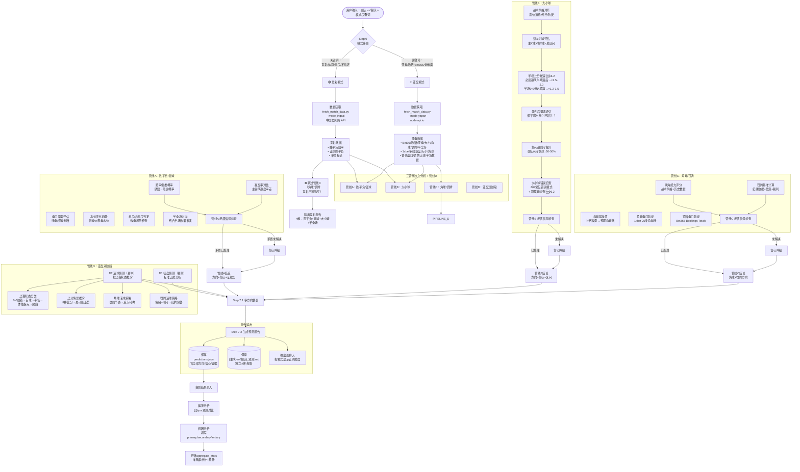

# 足球预测模型完整架构流程图



---

## 文字版架构总结

```
┌─────────────────────────────────────────────────────────┐
│                 用户输入：主队 vs 客队                    │
└────────────────────┬────────────────────────────────────┘
                     │
                     ▼
              ┌─── 模式路由 ───┐
              │                │
         🟢 竞彩模式      🔵 亚盘模式
              │                │
     ┌─── 中国竞彩网API    odds-api.io ───┐
     │   胜平负/让球      Bet365+1xbet    │
     │   单关标记         欧赔/亚盘/大小  │
     │                     角球/罚牌/半场 │
     └──────┬───          ────┬──────────┘
            │                 │
            ▼                 ▼
    ┌─────────────────────────────┐
    │    三管线独立分析            │
    │  ┌──────┐ ┌──────┐ ┌──────┐ │
    │  │管线A │ │管线B │ │管线C │ │
    │  │胜平负│ │大小球│ │角球  │ │
    │  │让球  │ │      │ │罚牌  │ │
    │  └──┬───┘ └──┬───┘ └──┬───┘ │
    │     │ 各管线独立矛盾检查     │
    │     │ 各管线独立信心校准     │
    └─────┼─────────┼─────────┼───┘
          │         │         │
          ▼         ▼         ▼
    ┌─────────────────────────────┐
    │  🔵 亚盘模式额外管线D       │
    │  ┌─────────────────────┐   │
    │  │ D1 初盘预测(赛前)   │   │
    │  │ 标准五维分析        │   │
    │  ├─────────────────────┤   │
    │  │ D2 滚球预测(赛中)   │   │
    │  │ • 比赛状态分类      │   │
    │  │ • 比分情景推演      │   │
    │  │ • 角球/罚牌滚球     │   │
    │  └─────────────────────┘   │
    └─────────────┬───────────────┘
                  │
                  ▼
    ┌─────────────────────────────┐
    │    报告输出 + 自动存档       │
    │  📄 predictions.json        │
    │  📄 {主队}vs{客队}_预测.md   │
    │  💬 聊天输出（按模式）       │
    └─────────────┬───────────────┘
                  │
                  ▼
    ┌─────────────────────────────┐
    │    赛后结果录入 → 偏差分析   │
    │    → 根因分析 → 统计更新    │
    └─────────────────────────────┘
```

---

## 模式输出维度对比

| 输出维度 | 🟢 竞彩模式 | 🔵 亚盘模式 D1(初盘) | 🔵 亚盘模式 D2(滚球) |
|:---------|:-----------:|:-------------------:|:-------------------:|
| 胜平负 | ✅ | ✅ | — |
| 让球胜平负 | ✅ | ✅ | — |
| 大小球 | ✅ | ✅ | ✅ (追大/小/观望) |
| 半全场 | ✅ | ✅ | — |
| 角球 | ❌ 不输出 | ✅ | ✅ (追角策略) |
| 罚牌 | ❌ 不输出 | ✅ | ✅ (红牌预警) |
| 比赛状态评估 | — | — | ✅ |
| 比分情景推演 | — | — | ✅ |
